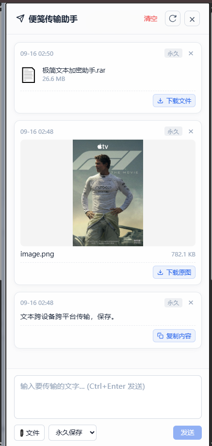
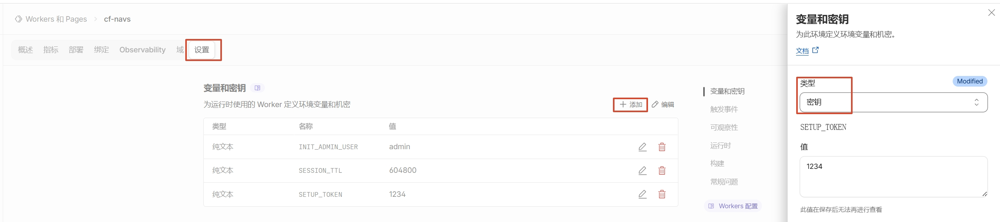

<div align="center">
  
  <h1>CF-Navs Transfer</h1>
  <p><strong>基于 CF-Navs 增强的云原生个人起始页 · 新增跨设备跨平台传输功能</strong></p>
  <p>
    本项目基于优秀开源项目 <a href="https://github.com/lbjxr/CF-Navs" target="_blank"><strong>CF-Navs</strong></a> 进行二次开发与功能扩展。<br>
    在完整保留原版优雅起始页、两级书签收纳、22 套内置主题与 Serverless 零运维特性的基础上，<br>
    <strong>新增了跨设备、跨平台的传输助手（支持便笺记事与 50MB 大文件极速传输）</strong>，让个人导航页无缝升级为多端协同的数字中枢。
  </p>

  <p>
    <a href="https://github.com/lbjxr/CF-Navs"></a>
    <a href="https://workers.cloudflare.com/"></a>
    <a href="https://developers.cloudflare.com/d1/"></a>
    <a href="https://developers.cloudflare.com/kv/"></a>
    <a href="https://developers.cloudflare.com/r2/"></a>
    <a href="https://svelte.dev/"></a>
    <a href="https://www.typescriptlang.org/"></a>
    <a href="LICENSE"></a>
  </p>

  <p>
    <a href="#-项目定位与背景">项目背景</a> ·
    <a href="#-核心功能矩阵">功能特性</a> ·
    <a href="#-增强特性跨设备跨平台传输助手">传输助手</a> ·
    <a href="#️-界面展示">界面展示</a> ·
    <a href="#-原版-cf-navs-无缝升级指南">平滑升级</a> ·
    <a href="#-快速部署指南">快速部署</a> ·
    <a href="#-部署后初始化与新手使用指引">初始化设置</a> ·
    <a href="#️-快捷键速查">快捷键</a> ·
    <a href="#-致谢与开源协议">致谢</a>
  </p>

  <p>
    <a href="https://github.com/wii-me/cf-navs-transfer">
      
    </a>
    <a href="https://github.com/wii-me/cf-navs-transfer/fork">
      
    </a>
  </p>
</div>

---

## 💡 项目定位与背景

### 为什么会有 CF-Navs Transfer？

- **原版 CF-Navs 的卓越基因**：
  由 [lbjxr](https://github.com/lbjxr) 开发的 [CF-Navs](https://github.com/lbjxr/CF-Navs) 是一款非常优雅的个人书签导航系统。它完全依托于 Cloudflare Workers + D1 + KV 的云原生架构，实现了**免服务器自建、零运维成本、秒级极速响应**。其两级分类体系、全站模糊搜索、22 款预设主题（纯色护眼与磨砂毛玻璃）以及严密的私密链接防护，深受广大极客与生产力爱好者的喜爱。

- **日常痛点：多设备间的信息流转**：
  在多设备（PC、Mac、iPhone、Android 手机、平板）协同办公与日常使用中，我们经常需要临时在各端之间互传一段验证码、一段备忘文本、一条临时链接、截屏图片或安装包。
  以往不得不借助微信/QQ的“文件传输助手”或第三方网盘，步骤繁琐且依赖客户端与第三方账号。

- **CF-Navs Transfer 的解法**：
  本项目以 **CF-Navs 为坚实基石**，在原生架构中深度融合了 Cloudflare R2 对象存储，开发了开箱即用的**传输助手**。无需打开任何额外软件，在浏览器起始页内随时按下 <kbd>Ctrl</kbd> + <kbd>J</kbd> 即可呼出面板，支持剪贴板截屏直接粘贴发送、50MB 大文件上传、原图灯箱缩放以及到期自动销毁清理。
  **既是强大赏心的浏览器起始页，又是触手可及的多端中转站。**

---

## ✨ 核心功能矩阵

### 🧭 1. 卓越的个人起始页与书签管理（完整继承自 CF-Navs）
- **两级分类层级**：清晰的一级分组与二级子分类架构，支持一键折叠、顶部导航分行与自适应左侧栏。
- **毫秒级全站检索**：支持对书签标题、URL、描述以及所属分类完整路径进行模糊搜索，支持快捷键随时聚焦。
- **自由拖拽与批量整理**：桌面端支持跨分类自由拖拽排序；手机端提供便捷的穿梭选项；后台支持多选批量迁移。
- **私密书签与私密分类**：一键设置“仅登录可见”。在未登录的访客模式下，接口层严格过滤私密数据，隐私安全无懈可击。
- **22 款内置精美主题**：提供纯色护眼、现代磨砂毛玻璃与暗黑深色外观，可微调卡片尺寸（统一 160px 规范并支持最低 40px 极窄布局）与自定义 CSS/JS。
- **图标本地优先缓存**：聚合数据支持 CacheStorage 本地持久化，秒级直出且极大降低边缘请求。
- **Chrome / Edge 扩展单向同步**：内置浏览器扩展，浏览网页时可一键将新增书签同步至起始页指定分类，不覆盖原有数据。
- **访问频次统计**：首页书签点击自动累计，后台提供访问量排行与零访问书签筛选。
- **无痛数据导入与备份**：完美支持 CF-Navs 原生 JSON 备份（增量或覆盖）、Sun-Panel 数据迁移以及浏览器标准书签 HTML 导入。

### 🚀 2. 深度增强的传输助手（本项目新增特性）
- **剪贴板即贴即传 (`Ctrl+V`)**：在传输助手面板按下 `Ctrl+V`（或移动端长按粘贴），自动识别纯文本或将剪贴板中的截屏图片直接上传发送，省去手动存图流程。
- **R2 50MB 大文件极速传输**：原生集成 Cloudflare R2 对象存储，支持文档、压缩包、图片、音视频及安装包等任意格式，单文件上限 **50 MB**，不消耗 D1 数据库配额。
- **图片高清全屏灯箱预览**：图片附件自动生成高清缩略图，点击即刻进入全屏灯箱无损查看与平滑缩放，支持一键安全重命名下载。
- **多档 TTL 自动销毁策略**：支持 **1小时**、**1天**、**7天** 及 **永久** 4 种保留策略，到期由边缘调度机制安全清理，避免闲置占用存储空间。
- **全局快捷唤起 (`Ctrl+J`)**：在导航首页及各页面随时按下 `Ctrl+J` / `Cmd+J`（或点击右上角传输图标），半浮动呼出传输助手，即用即走。

### 🛡️ 3. 银行级边缘安全与性能架构
- **全边缘无服务器架构**：运行于 Cloudflare 遍布全球的边缘节点，首屏毫秒级直出。
- **严密安全策略**：
  - 会话采用 PBKDF2 强哈希算法与 JWT 鉴权，支持 KV 撤销黑名单与防暴力破解频控。
  - 全站强制注入 `X-Frame-Options: DENY` 防点击劫持与 `X-Content-Type-Options: nosniff`。
  - 文件下载采用沙箱化 CSP 与 Attachment 强制隔离下载，切断存储型 XSS 隐患。
  - 服务端代理具备内网 SSRF 拦截与私密图标隔离。

---

## 🚀 增强特性：跨设备跨平台传输助手

<div align="center">
  
</div>

针对跨设备日常协同，CF-Navs Transfer 在原生起始页上实现了轻量无感的传输体验：

| 维度 | 体验细节 |
|---|---|
| **协同场景** | 电脑端截图后 `Ctrl+V` 发送，手机端打开起始页直接下载或预览；手机随手记下文字备忘，电脑端即时复制 |
| **存储介质** | Cloudflare R2 对象存储，**出网流量完全免费**，免去服务器硬盘与带宽负担，单文件上限 **50 MB** |
| **文件兼容** | 支持全格式：图片 (`.png`, `.jpg`, `.webp`)、文档 (`.pdf`, `.docx`, `.xlsx`)、压缩包 (`.zip`, `.rar`)、安装包 (`.apk`, `.dmg`) 等 |
| **图片灯箱** | 图片附件自动生成预览，点击唤起全屏灯箱，支持鼠标滚轮缩放、原图查看与安全下载 |
| **自毁策略** | 内置 1 小时、1 天、7 天及永久有效 4 档生命周期，过期自动清理，支持手动一键即时销毁 |
| **交互设计** | 快捷键 <kbd>Ctrl</kbd> + <kbd>J</kbd> 全局唤起/收起，采用右侧滑入/半浮动设计，不遮挡起始页主要内容 |

---

## 🖼️ 界面展示

### 1. 桌面端双主题对比（护眼纯色 vs 现代毛玻璃）
<table>
  <tr>
    <td align="center" width="50%">
      <strong>亮色模式（护眼 / 毛玻璃对角线对比）</strong><br><br>
      
    </td>
    <td align="center" width="50%">
      <strong>暗色模式（护眼 / 毛玻璃对角线对比）</strong><br><br>
      
    </td>
  </tr>
</table>

### 2. 移动端自适应布局
<table>
  <tr>
    <td align="center" width="50%">
      <strong>移动端 · 亮色模式</strong><br><br>
      
    </td>
    <td align="center" width="50%">
      <strong>移动端 · 暗色模式</strong><br><br>
      
    </td>
  </tr>
</table>

### 3. 传输助手（新增功能实机效果）
<p align="center">
  
  <br>
  <em>手机与 PC 均支持随时唤出，支持大图灯箱预览、文件一键下载与便笺复制</em>
</p>

### 4. 丰富的个性化设置与主题定制
<p align="center">
  
  <br>
  <em>22 款预设主题、卡片宽度与圆角调节、自定义 CSS/JS 注入预览</em>
</p>

---

## 🔄 原版 CF-Navs 无缝升级指南

如果你已经是 [CF-Navs](https://github.com/lbjxr/CF-Navs) 的老用户，想要在保留原有分类、书签和设置的前提下获得**传输助手**，升级非常平滑：

1. **更新仓库代码**：将你的 Fork 仓库更新并同步为本仓库 `wii-me/cf-navs-transfer` 的 `main` 分支代码。
2. **在 Cloudflare 创建并绑定 R2 存储桶**：
   - 在控制台 **R2 Object Storage** 中创建一个存储桶（例如命名为 `cf-navs-storage`）。
   - 进入你的 Worker **Settings (设置)** → **Bindings (绑定)**，添加一个 R2 存储桶绑定，变量名填 `STORAGE`，选择刚创建的桶。
3. **在 D1 中执行数据表增量升级 SQL**：
   打开 Cloudflare 控制台的 **D1 SQL Database** → 点击你原有的数据库 → 进入 **Console**，执行以下 SQL 语句（仅新增传输记录表，**不会影响原有书签数据**）：
   ```sql
   CREATE TABLE IF NOT EXISTS transfer_notes (
       id TEXT PRIMARY KEY,
       type TEXT NOT NULL,
       content TEXT,
       file_key TEXT,
       file_name TEXT,
       file_size INTEGER,
       mime_type TEXT,
       created_at INTEGER NOT NULL,
       expires_at INTEGER
   );
   CREATE INDEX IF NOT EXISTS idx_transfer_notes_created_at ON transfer_notes(created_at DESC);
   CREATE INDEX IF NOT EXISTS idx_transfer_notes_expires_at ON transfer_notes(expires_at);
   ```
4. **重新部署**：在 Deployments 页面点击重新部署，升级即告完成！原有数据丝毫不受影响，右上角将立即出现传输助手入口。

---

## 🚀 快速部署指南

适合初次接触的新用户。CF-Navs Transfer 基于 Cloudflare 原生无服务器生态，**无需自备服务器，零门槛免费部署**。

### 📋 所需 Cloudflare 资源清单

| 资源类别 | 绑定变量名 (Binding) | 默认命名建议 | 用途说明 |
|---|---|---|---|
| **Cloudflare D1** | `DB` | `cf-navs-db` | 存储分类、书签数据、站点配置以及传输助手元数据 |
| **Cloudflare KV** | `SESSION` | `cf-navs-session` | 存储管理员登录态、会话撤销黑名单、API 频控防爆破记录 |
| **Cloudflare R2** | `STORAGE` | `cf-navs-storage` | 存储传输助手上传的文件、图片与附件对象 |
| **Secret 密钥** | `SETUP_TOKEN` | 自定义高强度字符串 | 仅用于首次初始化 `/install` 创建管理员账号时的身份凭证 |

---

### 方式一：Cloudflare 控制台 0 代码一键部署（推荐）

1. **Fork 仓库**：点击右上角 **[Fork 本仓库](https://github.com/wii-me/cf-navs-transfer/fork)** 到你的 GitHub 个人账号。
2. **导入 Cloudflare**：进入 [Cloudflare 控制台](https://dash.cloudflare.com/)，依次点击 **Compute (Workers & Pages)** → **Create** → **Pages**（或 **Workers**）中的 **Import a repository**，选择刚才 Fork 的仓库。
3. **填写构建配置**：
   - **生产分支**：`main`
   - **Build command**：`npm run build`
   - **Deploy command**：`npx wrangler deploy`
   - **环境变量**：添加 `NODE_VERSION` = `24`
4. **检查并绑定 D1、KV 与 R2 资源**：
   部署完成后，在 Worker 的 **Settings (设置)** → **Bindings (绑定)** 中确认三大资源绑定：
   - **D1 数据库**：变量名 `DB` 指向 `cf-navs-db`
   - **KV 命名空间**：变量名 `SESSION` 指向 `cf-navs-session`
   - **R2 存储桶**：变量名 `STORAGE` 指向 `cf-navs-storage`
   > 💡 **特别提示（关于 R2）**：传输助手需要 R2 存储上传的文件与图片。如果控制台下拉菜单未自动找到存储桶，只需在 Cloudflare 左侧导航栏进入 **R2 对象存储**（首次使用点击开通免费计划），创建一个名为 `cf-navs-storage` 的桶，再回到 Worker 绑定中选择即可。
5. **添加初始化密钥**：
   在 **Settings (设置)** → **Variables and Secrets (变量与机密)** 中添加类型为 **Secret** 的 `SETUP_TOKEN`，填写一段自定义强密码（用于首次初始化认证）。
   <p align="center">
     
   </p>
   保存后对最新部署点击 **Retry deployment (重新部署)** 使密钥生效。
6. **初始化数据库与设置管理员密码**：
   > [!IMPORTANT]
   > 首次运行前需初始化数据库并设置管理员账号：
   > 1. 进入 Cloudflare 控制台 **D1** → 选择 `cf-navs-db` → **Console**，将仓库根目录的 [`schema.sql`](schema.sql) 内容完整复制并执行（包含书签与传输助手的全部数据表）。
   > 2. 随后访问你的站点域名末尾加上 `/install`（如 `https://your-nav.workers.dev/install`），输入 `SETUP_TOKEN`，设置管理员账号与密码（**密码强制要求至少 12 个字符**）。
   > 3. 安装成功后会自动登录，详细使用与安全收尾见下方[「部署后初始化与新手使用指引」](#-部署后初始化与新手使用指引)。
7. **绑定自定义域名（可选）**：
   站点默认生成的 `*.workers.dev` 域名开箱即可正常使用。如果需要绑定个性化独立域名，可在 Worker 的 **Settings (设置)** → **Domains & Routes (域和路由)** 中添加并启用你的自定义域名。

---

### 方式二：Wrangler CLI 极速部署（开发者推荐）

本地具备 Node.js 22+ 或 24 LTS 环境，只需 3 分钟即可通过命令行全自动完成：

```bash
# 1. 克隆代码并安装依赖
git clone https://github.com/wii-me/cf-navs-transfer.git
cd cf-navs-transfer
npm install

# 2. 登录 Cloudflare 账号并确认身份
npx wrangler login
npx wrangler whoami

# 3. 创建所需边缘资源（如云端已有同名资源可跳过对应创建命令）
npx wrangler d1 create cf-navs-db
npx wrangler kv namespace create SESSION
npx wrangler r2 bucket create cf-navs-storage # 首次使用 R2 请确认控制台已开通 R2 免费额度

# 4. 自动识别真实资源 ID 并写入本地 wrangler.local.toml
npm run setup:wrangler

# 5. 首次部署创建 Worker 实例
npm run deploy

# 6. 设置安装授权密钥 Secret
npx wrangler secret put SETUP_TOKEN

# 7. 一键初始化远程 D1 数据库完整表结构（含导航与传输助手数据表）
npm run db:init:remote

# 8. 重新部署使所有绑定与配置完全就绪
npm run deploy
```

部署完成后访问 `https://<your-worker>.workers.dev/install`，输入 `SETUP_TOKEN` 设置管理员账号密码即可完成初始化。安装成功后，可运行 `npx wrangler secret delete SETUP_TOKEN` 删除一次性安装令牌。

---

## 🎯 部署后初始化与新手使用指引

无论采用控制台部署还是 CLI 部署，首次部署上线后都需通过内置的初始化向导（`/install`）创建管理员凭据。

### 1. 访问 `/install` 初始化向导设置密码
打开浏览器访问你的站点地址并在末尾追加 `/install`（例如 `https://your-nav.workers.dev/install`）：
- **安装密钥 (`SETUP_TOKEN`)**：输入部署阶段在 Cloudflare Worker 的「变量和机密」中填写的 `SETUP_TOKEN` 字符串。
- **管理员用户名**：自定义你的后台管理账号（默认建议 `admin`，支持 1-64 位字符）。
- **管理员密码（重要）**：
  > [!IMPORTANT]
  > **系统强制要求密码长度至少 12 个字符**（长度范围 12-256 位，输入少于 12 位将无法提交并提示错误；建议混合大小写字母、数字与特殊符号以保障边缘账号安全）。
- **确认密码**：再次输入密码确保两次输入完全一致。

点击 **「完成安装」**，系统将在 D1 数据库中写入 PBKDF2 强哈希加密凭据，并**自动完成首次登录直接进入前台首页**。

### 2. 管理员日常登录入口
- **日常登录**：若会话过期或在手机、平板等新设备上访问，点击页面右上角或右下角浮动工具栏中的 **管理入口**（图标形如锁/钥匙），或直接访问 `/admin` 或 `/login`，输入账号与密码即可解锁全部管理权限。
- **修改密码**：管理员登录后，在后台「设置 → 账号安全」中可随时修改密码。
- **紧急凭据恢复**：若不慎遗忘密码导致无法登录，无需清空数据库，只需在 Cloudflare 控制台该 Worker 的 **变量和机密** 中添加 Secret `INIT_ADMIN_PASSWORD`、文本变量 `INIT_ADMIN_USER` 与 `RESET_ADMIN_CREDENTIALS`（填入任意新值，如 `reset-2026`），重新部署一次即可强制重置密码。

### 3. 新手开箱推荐 4 步走
1. **一键导入现有书签**：进入后台「数据管理 → 备份与恢复」，支持直接上传从 Chrome、Edge、Firefox 导出的 HTML 书签文件，或从 Sun-Panel / 原版 CF-Navs JSON 备份导入，全自动映射双层分类，省去手动逐条录入。
2. **设置站点公开/私密模式**：在后台「设置 → 站点设置」中按需配置：
   - **开启公开模式**：未登录访客可自由浏览非私密书签与分类，私密链接仅管理员登录后可见。
   - **关闭公开模式**：整站完全锁定，未登录访客无法查看任何分类与链接，打造 100% 纯个人私密导航站。
3. **定制精美主题与外观**：在后台「设置 → 主题与外观」中从 22 款预设主题（纯色护眼莫兰迪色、现代磨砂毛玻璃、极客暗黑深色等）中一键选用，并可自定义卡片尺寸（默认标准 160px，极窄模式可设为 40px）。
4. **畅享跨设备传输助手**：在站内任意页面随时按下快捷键 <kbd>Ctrl</kbd> + <kbd>J</kbd>（Mac 上为 <kbd>Cmd</kbd> + <kbd>J</kbd>）呼出传输助手，测试粘贴文字、直接按下 `Ctrl+V` 上传剪贴板截屏，或拖拽上传最大 50MB 的大文件。

### 4. 安全收尾建议
- 首次安装并确认能够正常登录后台后，请前往 Cloudflare 控制台的该 Worker **设置 → 变量和机密** 中，**删除 `SETUP_TOKEN`**。站点完成初始化后不再需要该令牌，删除可彻底阻断后续潜在未授权调用的风险。

---

## ⌨️ 快捷键速查

| 快捷键 | 作用域 | 功能说明 |
|---|---|---|
| <kbd>Ctrl</kbd> + <kbd>J</kbd> / <kbd>Cmd</kbd> + <kbd>J</kbd> | 全局 | 随时呼出或收起**传输助手**窗口 |
| <kbd>Ctrl</kbd> + <kbd>V</kbd> / <kbd>Cmd</kbd> + <kbd>V</kbd> | 传输助手面板 | 直接粘贴文本，或将剪贴板截屏作为附件直接上传 |
| <kbd>Ctrl</kbd> + <kbd>Enter</kbd> / <kbd>Cmd</kbd> + <kbd>Enter</kbd> | 传输助手输入框 | 快速提交并发送当前便笺与附件 |
| <kbd>Esc</kbd> | 全局 | 关闭当前打开的大图灯箱预览、设置弹窗或传输浮窗 |
| <kbd>/</kbd> | 导航首页 | 快速聚焦站内搜索输入框，开始全站检索 |

---

## 🛠️ 本地开发与项目结构

```bash
# 终端 1：启动本地 Worker 模拟后端 (Miniflare)
npm run dev

# 终端 2：启动前端 Vite 开发热更新服务器
npm run dev:web
```

访问 `http://localhost:5173` 即可进行开发。

```text
cf-navs-transfer/
├── src/                 # Svelte 5 前端视图与交互组件
│   ├── components/      # 传输助手 (TransferDrawer)、书签卡片、灯箱预览等
│   ├── routes/          # 首页、后台管理 (/admin)、初始化 (/install) 路由
│   └── stores/          # 全局响应式状态
├── worker/              # Cloudflare Workers 后端核心 (Hono)
│   ├── routes/          # 导航数据、分类管理、传输助手与 R2 文件中转接口
│   ├── middleware/      # 安全鉴权、频控限流、安全响应头中间件
│   └── services/        # D1 数据库交互、R2 上传与 TTL 生命周期清理
├── shared/              # 前后端共享类型定义
├── browser-extension/   # Chrome / Edge 浏览器新增书签自动同步插件
├── schema.sql           # D1 完整表结构定义（含书签与传输记录表）
└── wrangler.toml        # Cloudflare 架构配置文件
```

---

## ❓ 常见问题 (FAQ)

<details>
<summary><b>Q1: 本项目与原版 CF-Navs 有什么区别？</b></summary>
<br>
本项目基于原版 CF-Navs 进行深度增强。完全继承了 CF-Navs 的极简无服务器架构、两级书签收纳、22 款主题、拖拽整理和高私密性；同时通过深度结合 Cloudflare R2 对象存储，<b>新增了跨设备、跨平台的传输助手（支持便笺记事与 50MB 大文件极速传输功能）</b>，让日常使用的起始页同时承担个人中转站的角色。
</details>

<details>
<summary><b>Q2: 原版 CF-Navs 用户升级会丢失数据吗？</b></summary>
<br>
<b>完全不会。</b> 本项目的数据库结构对原版 CF-Navs 保持 100% 向下兼容。升级只需增加一个 R2 绑定并在 D1 中执行 <code>transfer_notes</code> 建表 SQL，原有书签、分类、站点设置均原封不动保留。
</details>

<details>
<summary><b>Q3: 上传的文件存放在哪里？会产生额外费用吗？</b></summary>
<br>
文件完全存放在你自己 Cloudflare 账号下的 R2 存储桶中。Cloudflare R2 具备极其实惠的免费额度（每月 10GB 免费存储容量，且<b>出网流量完全免费</b>）。对于日常多设备间的文档、截屏和便笺互传，完全在免费额度范围内。
</details>

<details>
<summary><b>Q4: 首次部署后访问 <code>/install</code> 提示数据库表不存在？</b></summary>
<br>
请进入 Cloudflare 控制台的 D1 数据库控制台（Console），将项目根目录下的 <a href="schema.sql"><code>schema.sql</code></a> 内容粘贴进去执行一次，执行成功后刷新 <code>/install</code> 即可正常设置管理员密码。
</details>

<details>
<summary><b>Q5: 如何设置私密书签与分类？</b></summary>
<br>
管理员登录后，在新建或编辑书签时勾选“设为私密链接”，或在分类设置中勾选“访客不可见”。未登录的访客将无法查看这些数据，接口层也会彻底剥离私密字段。
</details>

---

## 🤝 致谢与开源协议

- 🌟 **核心致谢**：本项目基于 **[CF-Navs](https://github.com/lbjxr/CF-Navs)**（原作者：[@lbjxr](https://github.com/lbjxr)）进行二次开发与功能增强。衷心感谢原作者的优秀构想与杰出贡献！
- 项目同时参考了 [Sun-Panel](https://github.com/hslr-s/sun-panel) 的设计理念，部分图标获取逻辑受到 [iori-nav](https://github.com/jy02739244/iori-nav) 的启发。
- 本项目采用 [MIT License](LICENSE) 开源协议，保持自由与开放。

<div align="center">
  <details>
    <summary><b>☕️ 喜欢 CF-Navs Transfer？请原作者与维护者喝杯咖啡 / Sponsor</b></summary>
    <br>
    <p>如果这个项目对你的日常工作有所帮助，欢迎赞助支持原作者团队！❤️</p>
    <a href="https://afdian.com/a/benjian" target="_blank">
      
    </a>
  </details>
</div>
