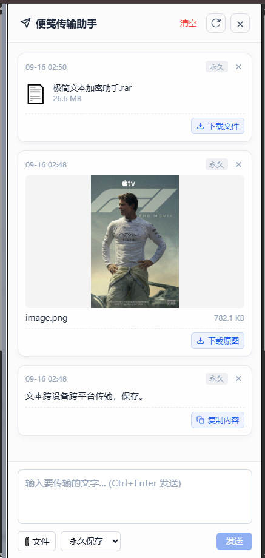

<div align="center">
  
  <h1>CF-Navs Transfer</h1>
  <p><strong>基于 CF-Navs 增强的云原生个人起始页 · 新增跨设备跨平台传输助手</strong></p>
  <p>
    本项目基于优秀开源项目 <a href="https://github.com/lbjxr/CF-Navs" target="_blank"><strong>CF-Navs</strong></a> 进行二次开发与功能扩展。<br>
    在完整保留原版优雅起始页、两级书签收纳、22 套内置主题与 Serverless 零运维特性的基础上，<br>
    <strong>新增了跨设备、跨平台的传输助手（支持便笺记事与 80MB 大文件极速传输）</strong>，让个人导航页无缝升级为多端协同的数字中枢。
  </p>

  <p>
    <a href="https://github.com/lbjxr/CF-Navs"></a>
    <a href="CHANGELOG.md"></a>
    <a href="https://workers.cloudflare.com/"></a>
    <a href="https://developers.cloudflare.com/d1/"></a>
    <a href="https://developers.cloudflare.com/kv/"></a>
    <a href="https://developers.cloudflare.com/r2/"></a>
    <a href="https://svelte.dev/"></a>
    <a href="https://www.typescriptlang.org/"></a>
    <a href="LICENSE"></a>
  </p>

  <p>
    <a href="#-近期更新日志">📢 更新日志</a> ·
    <a href="#-核心功能矩阵">功能矩阵</a> ·
    <a href="#-增强特性跨设备跨平台传输助手">传输助手</a> ·
    <a href="#️-界面展示">界面展示</a> ·
    <a href="#-快速部署指南3分钟极速上线">快速部署</a> ·
    <a href="#-部署后初始化与新手使用指引">初始化设置</a> ·
    <a href="#️-快捷键速查">快捷键</a> ·
    <a href="#-常见问题-faq">常见问题</a> ·
    <a href="CHANGELOG.md">完整变更记录</a>
  </p>

  <p>
    <a href="https://github.com/wii-me/cf-navs-transfer">
      
    </a>
    <a href="https://github.com/wii-me/cf-navs-transfer/fork">
      
    </a>
  </p>
</div>

---

## 📢 近期更新日志

> 详细历史与代码提交记录请查阅项目完整文件：[`CHANGELOG.md`](CHANGELOG.md)。

<details open>
<summary><b>🔥 最新版本亮点：v0.7.3-transfer（2026-10-04）</b></summary>
<br>

* 🛡️ **传输助手删除防误触与位移冷却重构**：
  * **瞬时状态锁定与 Loading 反馈**：点击删除（`×`）瞬间立刻锁定当前卡片（半透明并禁用操作），按钮转为微型 Spinner 动画，彻底杜绝网络慢时因无视觉反馈导致的重复连点；
  * **400ms 列表位移安全冷却**：记录被删除且从列表移出时，自动激活 400 毫秒的安全点击冷却，杜绝鼠标连击穿透误删刚顶上来的下一条记录。
* 🚀 **单文件上传上限放宽至 80MB**：
  * 前后端及文档全面放宽至 80MB，预留近 20MB 安全缓冲，完美规避 Cloudflare Workers 100MB 边缘拦截与 128MB 内存上限溢出。
* 🔄 **同步官方主仓库最新修复（v0.7.2 & v0.7.3）**：
  * 解决切回标签页私密书签丢失问题（#29）；
  * 首页私密书签直接渲染高清真实图标（#28）；
  * 页面底部书签右键菜单边缘防裁切（#30）；
  * 拖拽排序模式下固定底栏自适应避让（PROB-39）；
  * 搜索引擎切换即时联动与跨标签页同步（#25）。
</details>

---

## 💡 项目定位与背景

- **原版 CF-Navs 的卓越基因**：由 [lbjxr](https://github.com/lbjxr) 开发的原版 [CF-Navs](https://github.com/lbjxr/CF-Navs) 依托 Cloudflare Workers + D1 + KV 架构，实现了**免服务器、零成本、秒开响应**的优秀个人起始页。
- **日常痛点：跨设备流转繁琐**：多设备（PC、Mac、手机、平板）协同中，临时互传验证码、备忘文本、截屏或安装包，以往需依赖微信/QQ文件传输助手或第三方网盘。
- **CF-Navs Transfer 的解法**：在原生架构中深度整合 Cloudflare R2 对象存储，内置开箱即用的**传输助手**。在起始页内随时按下 <kbd>Ctrl</kbd> + <kbd>J</kbd> 唤出，支持剪贴板截屏直接粘贴发送、80MB 大文件极速中转、大图无损灯箱缩放与自动到期销毁。**既是好看好用的浏览器起始页，又是触手可及的多端中转站。**

---

## ✨ 核心功能矩阵

### 🧭 1. 卓越的个人起始页与书签管理（完整继承自 CF-Navs）
- **Spotlight 居中搜索 (<kbd>Ctrl</kbd>+<kbd>K</kbd>)**：全站书签毫秒级模糊检索，支持键盘直达与真实高清图标展示。
- **两级分类体系**：清晰的一级分组与二级子分类架构，支持一键折叠、顶部导航分行与自适应左侧栏。
- **私密书签与分类**：一键“仅登录可见”，未登录访客模式下严格物理隔离剥离私密数据。
- **22 款内置精美主题**：莫兰迪护眼纯色、现代磨砂毛玻璃与暗黑深色外观，支持统一卡片规范与极窄模式。
- **本地优先缓存**：CacheStorage 智能加速，公开图标聚合共享，秒级直出且极大降低边缘回源。
- **免重新部署密码恢复 (`/recover`)**：遗忘管理员密码时，持有部署密钥即可一键重置凭据。
- **数据无痛导入与备份**：支持原生 JSON、Sun-Panel 数据迁移及浏览器标准书签 HTML 导入。

### 🚀 2. 深度增强的传输助手（本项目新增特性）
- **剪贴板即贴即传 (`Ctrl+V`)**：传输面板内按 `Ctrl+V`，自动识别纯文本或直接将剪贴板截屏图片上传发送。
- **R2 80MB 大文件极速传输**：原生集成 Cloudflare R2 对象存储，支持文档、图片、音视频及安装包等任意格式，不消耗 D1 数据库配额。
- **图片高清全屏灯箱预览**：附件自动生成高清预览，点击即刻进入全屏灯箱无损查看与平滑缩放，支持一键下载。
- **防误触与位移冷却保护**：删除操作提供即时 Loading 锁定与 400ms 位移安全冷却，杜绝连击误删。
- **多档生命周期自动清理**：支持 **1小时**、**1天**、**7天** 及 **永久** 4 种保留策略，到期自动调度清理。
- **全局快捷唤起 (<kbd>Ctrl</kbd>+<kbd>J</kbd>)**：站内任意页面随时唤出，半浮动右侧抽屉，即用即走。

---

## 🚀 增强特性：跨设备跨平台传输助手

<div align="center">
  
</div>

| 维度 | 体验细节 |
|---|---|
| **协同场景** | 电脑端截图后 `Ctrl+V` 发送，手机端打开起始页直接下载或预览；手机随手记下文字备忘，电脑端即时复制 |
| **存储介质** | Cloudflare R2 对象存储，**出网流量完全免费**，单文件上限 **80 MB** |
| **文件兼容** | 支持全格式：图片 (`.png`, `.jpg`, `.webp`)、文档 (`.pdf`, `.docx`, `.xlsx`)、压缩包 (`.zip`, `.rar`)、安装包 (`.apk`, `.dmg`) 等 |
| **图片灯箱** | 图片附件自动生成预览，点击唤起全屏灯箱，支持鼠标滚轮缩放、原图查看与安全下载 |
| **安全机制** | 删除即时锁定防连击、400ms 位移冷却防误删；内置 1 小时至永久自毁周期，到期自动释放 R2 空间 |
| **交互设计** | 快捷键 <kbd>Ctrl</kbd> + <kbd>J</kbd> 全局唤起/收起，采用右侧滑入/半浮动设计，不遮挡起始页主要内容 |

---

## 🖼️ 界面展示

<table>
  <tr>
    <td align="center" width="50%">
      <strong>亮色模式（护眼 / 毛玻璃对比）</strong><br><br>
      
    </td>
    <td align="center" width="50%">
      <strong>暗色模式（护眼 / 毛玻璃对比）</strong><br><br>
      
    </td>
  </tr>
  <tr>
    <td align="center" width="50%">
      <strong>移动端自适应布局</strong><br><br>
      
    </td>
    <td align="center" width="50%">
      <strong>个性化后台设置面板</strong><br><br>
      
    </td>
  </tr>
</table>

---

## 🚀 快速部署指南（3分钟极速上线）

本项目基于 Cloudflare 全边缘无服务器架构，**无需自备服务器，零成本免费托管**。

### 🤖 方式一：让 AI 编程助手帮你全自动部署（最省心 ⭐）

> 💡 如果你在使用 **Cursor**、**Claude Code**、**Windsurf**、**GitHub Copilot** 或 **Google Antigravity** 等支持运行命令的 AI 编程助手，把仓库拉取到本地后，**直接把下面这句提示词复制发送给 AI 即可**：

```text
请帮我将当前项目完整部署到我的 Cloudflare 账号下：
1. 检查并确认我的 npx wrangler 登录状态（若未登录请引导我登录）；
2. 检查或自动创建所需的 D1 数据库 (cf-navs-db)、KV 命名空间 (SESSION) 和 R2 存储桶 (cf-navs-storage)；
3. 生成并配置本地 wrangler.local.toml 资源绑定文件；
4. 执行远程数据库初始化（运行 schema.sql），完成项目构建与部署；
5. 部署完成后执行线上健康检查，并向我汇报访问网址与初次访问 /install 设置管理员密码的步骤。
```

---

### 🌐 方式二：Cloudflare 控制台 0 代码一键部署（小白推荐）

1. **开通 R2 存储桶**：登录 [Cloudflare 控制台](https://dash.cloudflare.com/) → **R2 对象存储** → 创建存储桶 `cf-navs-storage`。
2. **Fork 仓库**：点击右上角 **[Fork 本仓库](https://github.com/wii-me/cf-navs-transfer/fork)**。
3. **导入 Cloudflare**：进入 **Workers & Pages** → 点击 **Create** → **务必选择「Workers」标签**（切勿选 Pages）并导入你的 GitHub 仓库。
4. **构建配置**：构建命令填 `npm run build`，部署命令填 `npx wrangler deploy`，并在环境变量添加 `NODE_VERSION` = `24`。
5. **添加资源绑定 (Bindings)**：进入该 Worker **设置 → 绑定**，添加：
   * D1 数据库：变量名 `DB`，数据库选择 `cf-navs-db`；
   * KV 命名空间：变量名 `SESSION`，命名空间选择 `cf-navs-session`；
   * R2 存储桶：变量名 **`STORAGE`**（大写），选择 `cf-navs-storage`。
6. **添加初始化密钥 (`SETUP_TOKEN`)**：在 **设置 → 变量和机密** 中添加 **Secret**（加密密钥）`SETUP_TOKEN`，填入一段复杂随机字符，保存后**在 Deployments 页面点击「Retry deployment (重新部署)」生效**。
7. **执行建表 SQL**：进入 **D1 SQL Database** → 点击数据库 → **Console**，把根目录下的 [`schema.sql`](schema.sql) 完整内容复制进去并执行。
8. **访问 `/install` 初始化**：打开你的 Worker 域名并在末尾追加 `/install`（如 `https://cf-navs.xxx.workers.dev/install`），输入 `SETUP_TOKEN` 并设置管理员密码（**系统强制要求 ≥12 位**）即告完成！

> 📖 如需查阅带每一步后台截图的详细教程，请参考 [完整图文部署指南 (DEPLOYMENT.md)](docs/guides/DEPLOYMENT.md)。

---

### 💻 方式三：Wrangler CLI 极速部署（开发者推荐）

本地具备 Node.js 22+ 或 24 LTS 环境，在终端中执行以下命令：

```bash
# 1. 克隆并安装依赖
git clone https://github.com/wii-me/cf-navs-transfer.git && cd cf-navs-transfer && npm install

# 2. 登录 Cloudflare 并创建资源
npx wrangler login
npx wrangler d1 create cf-navs-db
npx wrangler kv namespace create SESSION
npx wrangler r2 bucket create cf-navs-storage

# 3. 自动匹配资源 ID 生成本地配置并首次部署
npm run setup:wrangler && npm run deploy

# 4. 设置初始化密钥并初始化数据库
npx wrangler secret put SETUP_TOKEN
npm run db:init:remote

# 5. 重新部署使所有配置生效
npm run deploy
```

部署完成后访问 `https://<your-worker>.workers.dev/install` 设定管理员密码即可。

---

<details>
<summary><b>🚨 部署与排坑对照速查表（点击展开）</b></summary>
<br>

| 异常现象 / 报错信息 | 根本原因 | 一分钟排查与解决方案 |
|---|---|---|
| **构建报错**：`unsupported engine` 或打包语法错误 | Cloudflare 默认 Node.js 版本过低（低于 22.12） | 在 Worker **Settings → Builds** 环境变量中添加 `NODE_VERSION` = `24` 并重新部署。 |
| **部署后访问**：直接出现 `404 Not Found` 无法进入任何页面 | 在 Cloudflare 导入仓库时误选了 **Pages** 而非 **Workers** | 删除该 Pages 项目，在 **Workers & Pages** 下务必选择 **Workers** 标签重新导入。 |
| **访问 `/install` 提示**：「还缺少部署密钥 (setup_token_missing)」 | 未添加 Secret，或添加后**未重新部署**实例未热加载 | 确认 `SETUP_TOKEN` 为 **Secret** 类型；在 **Deployments** 页面点击最新部署右侧的 **Retry deployment (重新部署)**。 |
| **访问 `/install` 提示**：「还缺少存储绑定 (missing DB/SESSION/STORAGE)」 | Worker 未正确绑定 D1、KV 或 R2 存储桶 | 进入 Worker **设置 → 绑定**，确认名为 `DB` (D1)、`SESSION` (KV) 和 `STORAGE` (R2) 的三个大写绑定。 |
| **传输助手上传附件报错**：`R2 storage is not configured` (HTTP 500) | Worker 缺少 R2 绑定，或绑定变量名未大写为 `STORAGE` | 控制台开通 R2 并创建 `cf-navs-storage`；Worker 绑定中添加 R2 绑定，**变量名务必填写大写 `STORAGE`**。 |
| **创建管理员提示**：「密码不符合安全规范」或提交无响应 | 管理员密码少于 12 位（底层强校验 `MIN_PASSWORD_LENGTH = 12`） | 设置 12 位及以上的强密码（例如字母、数字和符号组合 `Admin@2026SecureNav`）。 |
| **访问首页或 `/install` 提示**：数据表不存在或 SQL 错误 | D1 数据库未执行建表脚本 | 进入 Cloudflare 控制台 **D1** → **Console**，完整粘贴 [`schema.sql`](schema.sql) 并执行。 |
| **CLI 命令行部署报错**：`Worker not found` 或 `secret put` 失败 | 在首次执行 `npm run deploy` 之前就尝试写入 Secret | 遵循正确顺序：先运行 `npm run deploy` 创建 Worker 实例，然后再运行 `npx wrangler secret put SETUP_TOKEN`。 |

</details>

---

## 🎯 部署后初始化与新手使用指引

1. **设置管理员密码 (`/install`)**：访问站点末尾追加 `/install`，输入 `SETUP_TOKEN`，设置管理员账号与密码（**强制 ≥12 位**），提交后系统自动完成首次登录并进入首页。
2. **安全收尾**：首次安装成功后，请前往 Worker **设置 → 变量和机密** 中**删除 `SETUP_TOKEN`**（彻底消除未授权访问隐患，后续若遗忘密码可通过 `/recover` 安全恢复）。
3. **日常登录入口**：点击页面右上角或浮动条的管理入口（锁形图标），或直接访问 `/admin`。
4. **一键导入书签**：进入后台「数据管理 → 备份与恢复」，支持直接导入浏览器导出的 HTML 书签或 Sun-Panel / 原版 CF-Navs JSON 备份，自动映射两层分类。
5. **畅享传输助手**：随时按下快捷键 <kbd>Ctrl</kbd> + <kbd>J</kbd>（Mac 上为 <kbd>Cmd</kbd> + <kbd>J</kbd>），体验剪贴板 `Ctrl+V` 贴图、80MB 大文件上传与防误删特性。

---

## ⌨️ 快捷键速查

| 快捷键 | 作用域 | 功能说明 |
|---|---|---|
| <kbd>Ctrl</kbd> + <kbd>J</kbd> / <kbd>Cmd</kbd> + <kbd>J</kbd> | 全局 | 随时呼出或收起**传输助手**窗口 |
| <kbd>Ctrl</kbd> + <kbd>K</kbd> / <kbd>Cmd</kbd> + <kbd>K</kbd> | 全局 | 随时呼出或关闭 **Spotlight 居中搜索命令面板** |
| <kbd>Ctrl</kbd> + <kbd>V</kbd> / <kbd>Cmd</kbd> + <kbd>V</kbd> | 传输助手面板 | 直接粘贴文本，或将剪贴板截屏作为附件直接上传 |
| <kbd>Ctrl</kbd> + <kbd>Enter</kbd> / <kbd>Cmd</kbd> + <kbd>Enter</kbd> | 传输助手输入框 | 快速提交并发送当前便笺与附件 |
| <kbd>↑</kbd> / <kbd>↓</kbd> / <kbd>Enter</kbd> | Spotlight 面板 | 键盘选择书签并直接打开（高亮项自动滚入视野） |
| <kbd>Esc</kbd> | 全局 | 关闭当前打开的大图灯箱预览、设置弹窗、Spotlight 或传输浮窗 |
| <kbd>/</kbd> | 导航首页 | 快速聚焦站内搜索输入框或唤起 Spotlight 全站检索 |

---

## ❓ 常见问题 (FAQ)

<details>
<summary><b>Q1: 本项目与原版 CF-Navs 有什么区别？</b></summary>
<br>
本项目基于原版 CF-Navs 深度增强。完整继承了极简无服务器架构、两级书签收纳、22 款主题、拖拽整理和高私密性；同时深度融合 Cloudflare R2 对象存储，<b>新增跨设备跨平台传输助手（支持剪贴板贴图、便笺记事、80MB 大文件传输及防误删保护）</b>，让日常使用的起始页同时承担个人中转站角色。
</details>

<details>
<summary><b>Q2: 原版 CF-Navs 老用户升级会丢失数据吗？</b></summary>
<br>
<b>完全不会。</b> 本项目的数据库结构对原版保持 100% 向下兼容。升级只需增加一个 R2 绑定（变量名 <code>STORAGE</code>），并在 D1 中执行增加 <code>transfer_notes</code> 表的 SQL，原有分类、书签与站点设置原封不动保留。
</details>

<details>
<summary><b>Q3: 上传的文件存放在哪里？会产生额外费用吗？</b></summary>
<br>
文件完全存放在你自己的 Cloudflare R2 存储桶中。Cloudflare R2 每月提供 <b>10GB 免费存储容量，且出网流量完全免费</b>。对于日常多设备间的文档、截屏和备忘互传，完全在免费额度之内。
</details>

<details>
<summary><b>Q4: 首次部署后访问 <code>/install</code> 提示数据库表不存在？</b></summary>
<br>
请进入 Cloudflare 控制台的 D1 数据库控制台（Console），将项目根目录下的 <a href="schema.sql"><code>schema.sql</code></a> 内容完整粘贴进去执行一次，执行成功后刷新 <code>/install</code> 即可正常设置管理员密码。
</details>

<details>
<summary><b>Q5: 如何设置私密书签与分类？</b></summary>
<br>
管理员登录后，在新建或编辑书签时勾选“设为私密链接”，或在分类设置中勾选“访客不可见”。未登录访客将无法查看这些数据，接口层会彻底物理过滤私密字段。
</details>

---

## 🤝 致谢与开源协议

- 🌟 **核心致谢**：本项目基于 **[CF-Navs](https://github.com/lbjxr/CF-Navs)**（原作者：[@lbjxr](https://github.com/lbjxr)）进行二次开发与功能增强。衷心感谢原作者的优秀构想与杰出贡献！
- 项目同时参考了 [Sun-Panel](https://github.com/hslr-s/sun-panel) 的设计理念，部分图标获取逻辑受到 [iori-nav](https://github.com/jy02739244/iori-nav) 的启发。
- 本项目遵循 [Apache-2.0 License](LICENSE) 开源协议，项目归属信息详见 [`NOTICE`](NOTICE)。
- 如果你 Fork 或重新分发基于本项目的修改版本，请保留 `LICENSE`、`NOTICE` 与原版权声明，并明确注明基于 CF-Navs。

<!-- 爱发电赞助区 (折叠卡片) -->
<hr>

<div align="center">
  <details>
    <summary><b>☕️ 喜欢 CF-Navs Transfer？请原作者与维护者喝杯咖啡 / Sponsor</b></summary>
    <br>
    <p>如果这个项目对你的日常工作有所帮助，欢迎赞助支持原作者团队！❤️</p>
    <a href="https://afdian.com/a/benjian" target="_blank">
      
    </a>
  </details>
</div>
