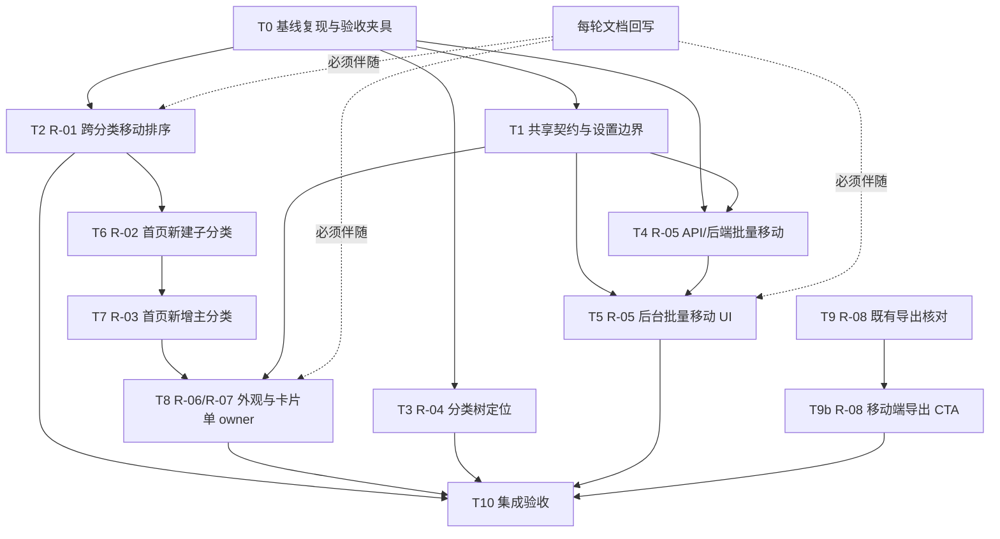

# 开发任务规划：Open Issue 需求实现（R-01 ～ R-08）

> **文档状态：R-01～R-08 的历史开发与验收记录。** 下文 Tn 台账中的「仍 Open / 待同步 / 待部署」保留当时语境，不是当前待办；v0.4.0 闭环依据见 [Issue 需求记录](../reference/GITHUB_ISSUES_REQUIREMENTS.md)，新一轮开放需求见 [开启 Issue 任务清单](OPEN_ISSUES_TASK_LIST.md)。
>
> 本文基于 `docs/reference/GITHUB_ISSUES_REQUIREMENTS.md` 的 R-01～R-08，负责把需求整理成可执行、可并行、可验收的开发任务。本文不修改源码、数据库、API 或云端 Issue，不把 Open Issue 自动视为已完成。
>
> **来源基线：** `docs/reference/GITHUB_ISSUES_REQUIREMENTS.md`（Open Issue 快照及已确认决策）
>
> **现有任务文档范式：** `docs/plans/DEV_TASK_BREAKDOWN_UI_NAV_EXPORT.md`
>
> **当前工作流：** 默认分支 `develop`；实现任务不得擅自执行 `git add`、`git commit`、`git push`、部署或云端 Issue/Project 写操作。

---

## 0. 交付目标与边界

### 0.1 本轮目标

覆盖以下正式需求，并为每项建立责任人、文件边界、依赖、测试门和文档回写点：

| 需求 | 内容 | 本文处置 |
| --- | --- | --- |
| **R-01** | 一级分类到二级分类的书签移动与排序 | 实现缺陷修复；补 PC 一级→二级、空分类回归；移动端首版使用“移动到分类”菜单 |
| **R-02** | 登录态首页新建子分类入口 | 在 R-01 首页交互流稳定后实现 |
| **R-03** | 登录态首页新增主分类入口 | 明确延后到 R-02 之后，不与 R-02 同轮交付 |
| **R-04** | 首页编辑书签时定位当前分类 | 复用分类树，打开时展开父级并滚动高亮，不改变表单值 |
| **R-05** | 后台批量移动书签 | 新增并锁定 API/共享类型、后端原子操作、后台跨页选择工具栏 |
| **R-06** | 一级/二级分类字体和图标大小 | 按层级全局设置，接入外观页、预览和全部规定显示场景 |
| **R-07** | 卡片最小宽度下限评估 | 详情风格 44 px 硬阈值与 44–80 px 提示；极简风格宽度控件置灰 |
| **R-08** | 部分导出备份 | 不重复实现；核对源码、部署版本和原作者预期后同步状态 |

### 0.2 非目标与红线

- 不纳入 #9 评论中的候选贡献：前台移动端编辑、内网/NAS 地址、浏览器扩展、新标签页接管、油猴脚本和截图实现。
- 不重新规划 Closed Issue；不以已有源码能力替代云端 Issue 关闭。
- 不为移动端建立另一套分类层级、书签归属、排序或权限语义。
- 不把鼠标 hover、右键或长按拖动作为移动端唯一入口。
- 不通过改前端提示、吞掉错误或静默回退来掩盖保存冲突、权限错误或非法分类目标。
- 不在 R-07 中只修改一个 `min` 数字；必须同时覆盖输入、保存、旧数据读取、布局计算、预览和实际首页网格。
- R-08 不新增导出接口、不复制已有按分类导出逻辑；云端 Issue/评论更新必须另有明确授权。

### 0.3 完成定义

一个任务只有同时满足以下条件，才允许从 `进行中` 改为 `已完成`：

1. 代码或核对动作覆盖该任务全部验收标准；
2. 任务专属测试门已执行并记录真实结果；
3. 本文 §8 进度台账已更新状态、实际文件、验证命令/场景、结果和提交状态；
4. `docs/reference/GITHUB_ISSUES_REQUIREMENTS.md` 已回写对应需求的状态/验收证据/实现链接或“待同步”事实，不能留空；
5. 若接口、共享类型、设置契约或现有行为发生变化，同轮更新 `docs/reference/API_CONTRACT.md` 或相关参考文档；
6. 未验证的行为必须标为“未验证”，不得用类型检查或单元测试代替真实 UI/API 验收。

---

## 1. 任务完成与文档同步纪律（强制）

### 1.1 单任务闭环

每个任务按以下顺序闭环，不能连续完成多个任务后再统一补记录：

1. **实现/核对**：只修改任务所有权表中的文件；发现跨边界需求时先协调 owner。
2. **任务测试**：运行该任务的专属测试门；失败时保持 `进行中` 或改为 `阻塞`，写明原因。
3. **状态回写**：在本文 §8 把任务状态、实际文件、验证结果和残余风险写全。
4. **需求回写**：在 `GITHUB_ISSUES_REQUIREMENTS.md` 更新对应 R 项的状态标签、验收证据和当前 Issue 链接；不要直接写“已关闭”。
5. **进入下一任务**：只有前四步完成，依赖任务才可开始。

### 1.2 状态取值

| 状态 | 含义 |
| --- | --- |
| `未开始` | 依赖和文件边界已确定，但未执行实现/核对。 |
| `进行中` | 已开始，专属测试或文档回写尚未完整。 |
| `已完成` | 代码/核对、任务测试、本文台账和需求文档均已闭环。 |
| `阻塞` | 依赖、产品决策、部署核对或环境问题阻止继续；必须写明可复现阻塞原因。 |

### 1.3 文档回写最小内容

每个任务完成时，至少补齐：

- 任务状态和完成批次；
- 实际改动文件（不写计划文件名代替实际文件）；
- 专属验证命令、浏览器断点/数据场景或部署核对结果；
- 失败分支、冲突、权限、移动端和窄屏是否已验证；
- 对应 R 项的验收证据及 Issue 链接；
- 是否提交（默认不提交，写“未提交”）。

---

## 2. 当前实现基线与共享约束

| 能力 | 当前基线 | 任务影响 |
| --- | --- | --- |
| 首页跨分类排序 | `Home.svelte` 维护本地草稿，`CategorySection.svelte` 通过 `sortableList` 产生跨列表转移，保存到 `POST /api/bookmarks/reorganize` | R-01 必须修复真实缺陷而不是重建另一套排序语义 |
| 重排接口 | 请求为完整 `category_orders`；冲突使用 `ErrCode.CONFLICT=1006`；D1 多语句更新通过 batch 执行 | R-01 移动端菜单和 R-05 批量移动必须保持冲突反馈和原子性语义 |
| 分类层级 | 最多两层；`parent_id: null` 为一级，非空为二级 | R-02/R-03/R-04/R-05 不得产生三级或错误父级 |
| 分类创建 | `CategoryEditModal` 与分类 API 已在后台使用；首页已有登录态新建子分类和新增主分类入口 | R-02/R-03 保持两层层级、权限和既有表单语义 |
| 分类选择器 | `CategoryTreeSelect` 打开时展开当前二级分类父级，支持当前项滚动定位、选中状态和长树滚动 | R-04 只增强定位，不改变选择值 |
| 后台书签列表 | 已有搜索、分页、跨页选择、批量删除和批量移动操作；批量移动复用 expected 快照与冲突语义 | R-05 不破坏跨页/筛选行为和原子性 |
| 设置模型 | `card_size.width` 当前有效范围 44–400 px；`category_display` 已持久化并由 shared/client/Worker 统一归一化 | R-06/R-07 维护设置、预览、实际布局和窄屏安全约束 |
| 部分导出 | `BackupPanel.svelte`、`appBackup.ts`、`appImportExport.ts` 已支持按分类导出及父分类补全 | R-08 只做行为/部署/预期核对 |

### 2.1 共同数据与交互原则

- PC 和移动端共享分类 ID、书签分类归属、排序保存、冲突码和管理员鉴权。
- 所有排序、批量移动和编辑保存都先形成可见状态；失败时保留原因，取消或冲突恢复可解释。
- 分类树必须表达完整路径、当前项、禁用项原因和关闭状态。
- 移动端弹层、工具栏、树和错误提示不得超出视口；图标按钮必须保留可访问名称。
- 任何“自动定位”只能改变展开、滚动、焦点和高亮，不能隐式改变表单值。

---

## 3. 依赖图与并行批次

### 3.1 推荐执行批次

| 批次 | 可并行任务 | 前置 | 说明 |
| --- | --- | --- | --- |
| **批次 0** | T0 基线复现与验收夹具 | 无 | 补齐 R-01 缺陷浏览器、源/目标结构和准确表现；整理测试数据约束。 |
| **批次 1** | T1 共享契约与设置边界、T2 R-01、T3 R-04、T9 R-08 核对 | T0 | T1 先锁共享类型/设置边界；T2/T3/T9 负责各自文件，不并行写同一硬冲突文件。 |
| **批次 2** | T4 R-05 API/后端、T6 R-02 首页子分类 | T0+T1（T4）；T2（T6） | T4 先锁后端接口；T6 独占首页入口合流文件；两者互不触碰同一硬冲突面。 |
| **批次 3** | T5 R-05 后台 UI、T7 R-03 首页主分类、T9b R-08 移动端导出 CTA | T4（T5）；T6（T7）；T9（T9b） | T5 与 T7 可并行；T9b 只改既有导出面板移动端布局，必须在 T9 发现缺口后执行。 |
| **批次 5** | T10 集成验收与最终收尾 | T2～T9、T9b 全部完成 | 运行全量检查、API 冒烟、真实 Chrome 桌面/移动端回归，并完成最终文档同步。 |

> T2 与 T6/T7 都会接触 `Home.svelte` 或 `CategorySection.svelte`，因此不是同一批次的并行编辑。T8 统一承接 R-06/R-07 的共享外观和卡片边界，牺牲两项之间的并行换取可审查的单 owner。

---

## 4. 文件所有权与冲突治理

### 4.1 文件所有权总表

| 文件/目录 | owner 任务 | 允许的改动范围 | 冲突规则 |
| --- | --- | --- | --- |
| `tests/` 中 R-01 纯逻辑/回归 fixture | T2 | 排序草稿、跨分类、空目标、取消/冲突 | 只新增或修改 R-01 测试；不得重写共用 fixture 语义 |
| `src/lib/sortableList.ts` | T2 | 跨列表拖放边界、空目标和移动端不依赖拖动 | T2 完成前其他任务不得改 |
| `src/lib/homeSort.ts` | T2 | 移动草稿和完整分类顺序的纯逻辑 | 与 Home 编排分离；由 T2 单元测试覆盖 |
| `src/views/Home.svelte`、`src/components/CategorySection.svelte` | T2→T6→T7→T8 | 按批次串行：排序、子分类入口、主分类入口、分类视觉变量 | 硬冲突；同一时间只有当前 owner 可改 |
| `src/components/BookmarkCard.svelte`、`BookmarkContextMenu.svelte` | T2 | 移动端“移动到分类”菜单和排序态防误触 | R-04 不改；R-05 后台 UI 不改 |
| `src/components/CategoryTreeSelect.svelte`、`src/lib/categorySelect.ts`、`BookmarkBaseFields.svelte`、`BookmarkEditModal.svelte` | T3 | 当前分类展开、滚动、选中/不可用状态、焦点 | T3 完成前不嵌入首页创建逻辑 |
| `worker/routes/bookmarks.ts`、`worker/lib/db/bookmarks.ts`、必要的 `worker/lib/db/sort.ts` | T4 | R-05 批量移动路由、原子校验和冲突映射 | T2 只能复用既有 reorganize，不改 R-05 后端文件 |
| `shared/types.ts` | T1 | R-05 请求/响应和 R-06/R-07 设置字段/类型 | 单 owner；T4/T5/T8 通过已锁定类型接入，不直接并行编辑 |
| `shared/settings.ts`、`src/lib/settingsForm.ts`、`src/lib/appData.ts`、`worker/lib/settingsData.ts`、`schema.sql` | T1 | R-06/R-07 默认值、合法范围、旧数据归一化和前端表单映射 | 单 owner；T8 不重新定义范围，只实现 UI 和显示消费 |
| `docs/reference/API_CONTRACT.md` | T4 | R-05 公开接口、请求/响应、错误语义 | T4 完成后 T5 只能引用，不改契约 |
| `src/lib/api.ts`、`src/components/admin/BookmarkListPanel.svelte`、`AdminTabContent.svelte`、`src/App.svelte` | T5 | 批量移动调用、跨页选择工具栏、确认/错误/刷新 | T5 不改 Home；App 中只改后台批量操作接线段 |
| `src/lib/batchMove.ts`、`tests/unit/batchMove.test.ts` | T5 | 组装选中书签的 expected 快照请求 | 只消费 T1 锁定的共享类型；单测覆盖跨页顺序和缺失 sort |
| `src/components/SettingsPanel.svelte`、`src/components/settings/`、`SettingsHomePreview.svelte` | T8 | R-06/R-07 外观分区、预览、控件联动和卡片范围提示 | R-06/R-07 单 owner；不与其他设置任务并行 |
| 分类显示消费文件：`CategorySection.svelte`、`HomeCategoryScope.svelte`、`Sidebar.svelte`、`Home.svelte` 的分类/搜索分组显示段 | T8 | CSS 变量、按层级字号/图标尺寸、移动端 0.88 派生 | 必须在 T7 完成后串行接入；不得复制硬编码比例 |
| `src/components/BackupPanel.svelte` 的移动端导出 CTA 样式 | T9b | 正常流式全宽按钮，位于分类树下方和导入卡片上方，不遮挡内容 | 必须在 T9 核对发现缺口后串行修复，不改导出数据逻辑 |
| `src/components/BackupPanel.svelte`、`src/lib/appBackup.ts`、`src/lib/appImportExport.ts` | T9 | 仅核对现有行为，若发现缺陷必须先回写需求再另开实现任务 | 本轮禁止重复实现或改写导出逻辑 |
| `tests/`、`scripts/`、`docs/reference/` 的测试/证据段 | 各自 owner | 任务专属测试和证据 | 不允许用无关全量结果替代任务门 |

### 4.2 冲突处理规则

- `shared/types.ts`、设置归一化文件、`schema.sql`、`Home.svelte`、`CategorySection.svelte` 和 `SettingsHomePreview.svelte` 都是硬冲突面，必须遵循上表单 owner 串行。
- 若实现发现必须跨 owner 修改，先暂停当前任务，在本文进度台账记为 `阻塞`，并把新的依赖和 owner 写入文档；不得直接抢改文件。
- 公共 CSS 优先使用现有 CSS 变量和组件内 scoped style；若必须改全局样式，改动归当前单 owner 任务，并在任务测试中覆盖其他显示场景。
- 任务完成后的后续修复仍属于原任务的收尾，不得先把任务标为完成再以“临时修复”绕过状态回写。

---

## 5. 详细任务卡

## T0：基线复现与验收夹具（R-01/R-08 前置）

**目标**：把需求文档中仍待实现阶段补齐的信息变成可复现记录，并固定后续任务使用的最小分类/书签 fixture。
**依赖**：无。T0 只做基线复现、核对和测试夹具记录，不修改产品源码。

**文件边界**：允许写入本文档和 `docs/reference/GITHUB_ISSUES_REQUIREMENTS.md` 的补充证据；临时脚本、临时数据和截图只放在未跟踪验证目录，不纳入提交。T0 不修改 `src/`、`worker/`、`shared/` 或数据库。

**PC / 移动端核对范围**：PC 核对一级→二级、空目标和拖动请求；移动端核对“移动到分类”入口是否存在、分类树/弹层是否可用以及当前缺口。两端都只记录基线事实，不把缺失能力误报为通过。

**工作内容**：

- 在不修改产品代码的前提下复现 R-01：记录浏览器、视口、源分类/目标分类层级、书签是否为一级直属、目标是否为空、拖动后的实际结果和网络请求。
- 确认现行 `POST /api/bookmarks/reorganize` 的请求、成功、冲突和刷新行为；不得把“当前代码已有能力”直接记为 Issue 完成。
- 设计最小测试数据：至少两个一级分类；至少一个一级直属书签；至少一个有二级分类的一级分类；至少一个空目标分类；含普通和私密边界样本。
- 固定 R-08 核对清单：源码导出结果、部署版本、选择一级/二级分类后的分类/书签数量、settings 开关、replace/merge 回导结果。

**输出**：复现记录、测试 fixture 约束、R-01/R-08 的待补信息写回 `GITHUB_ISSUES_REQUIREMENTS.md`。

**测试门**：

- 运行最小 API/浏览器复现，并记录实际请求和结果；
- 若只完成静态核对，必须在台账写明“未做真实运行验证”；
- 不以 `npm run type-check` 代替复现测试。

**完成回写**：更新本文 T0 台账；更新需求文档 §7 R-01/R-08 的“实现阶段补齐”字段；状态仍为 Open/待实现或待核对，不得写已完成。

---

## T1：共享契约与设置边界（R-05/R-06/R-07）
**目标**：锁定 R-05 批量移动、R-06 分类视觉设置和 R-07 卡片宽度的共享数据/API 边界，供后续实现任务无歧义接入。

**依赖**：T0。**可与 T2、T3、T9 并行；T4 必须等待本任务完成；`shared/types.ts` 和设置数据文件由本任务独占。**

**工作内容**：

### T1.1 R-05 批量移动契约

- 在 `shared/types.ts` 锁定批量移动请求、响应和插入位置的类型；请求必须能表达选中书签集合、目标分类、`追加到末尾/插入到顶部` 和服务端冲突所需的集合/版本校验信息。
- 明确成功响应的数量/目标信息和失败错误包络，不引入“部分成功”响应。
- 不破坏既有 `BookmarkReorganizeReq`；批量移动路径固定为独立的 `POST /api/bookmarks/batch-move`。T4 负责将已锁定的请求/响应/错误语义写入 `API_CONTRACT.md`，T5 只能调用该路径。

### T1.2 R-06 分类视觉设置模型

- 定义一级/二级字号和图标尺寸字段、默认值、最小/最大范围及移动端 0.88 派生规则。
- 同步设置 key 白名单、公开设置透传、旧数据缺失时的安全默认值。
- 不引入每个分类独立覆盖，不让一级设置继承二级设置。

### T1.3 R-07 卡片宽度范围

- 将详情风格宽度规则固定为：`min=44`、`max=400`；`44 <= width < 80` 可保存但产生美观提示；`width < 44` 在输入、保存和旧数据读取时统一钳制为 44。
- 极简风格不另设宽度有效值；宽度控件由 `card_style !== 'info'` 置灰，尺寸由 `card_icon_size` 决定。
- 明确服务端/客户端各自的校验职责，避免只改客户端而留下 API/旧数据绕过路径。

**涉及文件**：

- `shared/types.ts`
- `shared/settings.ts`
- `src/lib/settingsForm.ts`
- `worker/lib/settingsData.ts`
- `schema.sql`
- 对应共享契约单元测试
**PC / 移动端契约检查**：T1 不改 UI 呈现；确认同一共享类型、默认值和错误语义同时供 PC 与移动端分支消费，运行客户端类型检查覆盖两端代码路径。视觉、触控尺寸和窄屏布局分别由 T2、T5、T8 验收，不能用 T1 的契约测试替代。

**测试门**：

- `npx vitest run` 的设置/共享契约相关测试（至少覆盖旧数据缺字段、非法数字、44/43/80/400/401 边界、info/icon 规则）；
- `npm run type-check`；
- 若新增 API 类型，补请求/响应运行时校验测试，不只断言 TypeScript 类型存在。

**完成回写**：本文 T1 台账 + `GITHUB_ISSUES_REQUIREMENTS.md` 对应 R-05/R-06/R-07 的契约/范围证据；接口或设置公开行为变化时同步 `API_CONTRACT.md`。

---

## T2：R-01 跨分类移动与排序
**目标**：在不改变既有完整排序契约的前提下，修复跨分类移动并交付移动端菜单替代路径。

**依赖**：T0；可与 T1、T3、T4、T9 并行。**T2 独占首页排序相关文件。**

**工作内容**：

- 修复并验证一级分类→同父级二级分类、其他一级分类、其他二级分类和空分类的跨分类移动。
- 保持排序会话为本地草稿：拖动不打开书签、不立即写库；保存时提交每个受影响分类的完整顺序及新 `category_id`；取消恢复进入会话前状态。
- 保持现有 `POST /api/bookmarks/reorganize` 及 `CONFLICT=1006` 语义；冲突提示必须明确“数据已变化，请刷新后重试”，并重新加载服务端数据，不以成功提示覆盖错误草稿。
- PC 使用拖放目标高亮和分类名反馈；空分类可接收。
- 移动端首版在书签操作菜单提供“移动到分类”：复用分类树、目标路径、保存/冲突规则；不把触控拖动作为唯一入口，也不为首版增加触控拖动。
- 排序态禁止书签打开，菜单和移动操作不与排序拖动误触冲突。

**涉及文件**：

- `src/lib/sortableList.ts`
- `src/views/Home.svelte`
- `src/components/CategorySection.svelte`
- `src/components/BookmarkCard.svelte`
- `src/components/BookmarkContextMenu.svelte`
- 需要时仅接入现有 API/回调，不改变 T1 锁定的共享类型

**测试门**：

- 针对排序草稿、跨分类转移、空目标、取消和冲突恢复的单元测试；
- 真实 PC 浏览器场景：一级→二级、空二级、其他一级/二级、拖动中点击不打开、取消无写入、保存后刷新归属/顺序保持；
- 真实移动端场景：不使用拖动，通过菜单完成移动；树可滚动/关闭，目标完整路径可见，成功/失败反馈明确；
- 记录控制台错误、页面异常和失败请求，不得只记录“页面打开”。

**完成回写**：本文 T2 台账 + 需求文档 R-01 的 PC/移动端验收证据；若复现后发现原方案需调整，先回写需求文档再继续实现。

---

## T3：R-04 编辑书签时定位当前分类
**目标**：让书签编辑分类树打开即定位当前分类，同时保持表单值和权限语义不变。

**依赖**：T0；可与 T1、T2、T4、T9 并行。**T3 不修改 Home 排序文件。**

**工作内容**：

- 打开编辑有二级分类书签时，分类树展开对应一级父级并把当前二级项滚动到可视区域；一级分类书签直接高亮一级项。
- “定位”只改变展开、滚动、焦点和高亮，不改变 `category_id`；打开/关闭选择器不得产生脏值。
- PC 支持键盘焦点和可视定位；移动端弹层打开后滚动到当前项，长列表可滚动、可关闭。
- 当前分类已删除或不可见时显示“当前分类不可用”（最终文案在实现时固定并写回需求文档），不静默选择第一个分类；保存沿用分类引用/权限校验。
- 新建分类后不在本流程自动选中。

**涉及文件**：

- `src/components/CategoryTreeSelect.svelte`
- `src/lib/categorySelect.ts`
- `src/components/BookmarkBaseFields.svelte`
- `src/components/BookmarkEditModal.svelte`
- 相关组件测试和样式

**测试门**：

- 组件/纯逻辑测试：一级当前项、二级父级展开、滚动调用、高亮/焦点、不可用值、打开关闭值不变；
- 真实 PC 键盘场景：打开、Arrow 导航、当前项可视、关闭后值不变；
- 真实移动端场景：长树滚动、当前路径可见、关闭/返回可用；
- 权限/无效分类保存测试，确保自动定位没有绕过服务端校验。

**完成回写**：本文 T3 台账 + 需求文档 R-04 的异常文案和验收证据。

---

## T4：R-05 批量移动 API 与后端原子操作
**目标**：实现管理员批量移动 API 的校验、排序位置、原子更新与冲突响应。

**依赖**：T1。可与 T2、T3、T9 并行；T5 必须等待 T4 完成。**

**工作内容**：

- 按 T1 锁定的共享类型实现独立的 `POST /api/bookmarks/batch-move` 接口；不扩展既有 `/api/bookmarks/reorganize`，避免改变完整排序请求的既有语义。接口路径、请求/响应和错误包络必须同步写入 `API_CONTRACT.md`。
- 服务端校验管理员身份、ID 数量上限、所有选中书签存在、目标分类存在且可见/合法、两层分类约束和私密权限。
- 支持目标分类内“追加到末尾”和“插入到顶部”，默认追加到末尾；不实现精确插入任意位置。
- 将分类归属更新和目标排序更新放在一次受保护的原子操作中；集合/状态校验失败整体失败，不产生部分成功。
- 沿用 `BookmarkReorganizeError` → `ErrCode.CONFLICT=1006`；其它服务端异常使用既有 `SERVER_ERROR=1500` 语义，不能把冲突笼统归为 1500。
- 成功返回可供前端清空选择、刷新路径和显示数量的稳定结果；失败返回统一包络和可读原因。

**涉及文件**：

- `worker/routes/bookmarks.ts`
- `worker/lib/db/bookmarks.ts`
- 必要时 `worker/lib/db/sort.ts`
- `docs/reference/API_CONTRACT.md`
- `tests/` 中后端路由/数据库测试
**PC / 移动端契约检查**：T4 不验收具体 UI，但必须确认 PC 和移动端都能使用同一批量移动请求/响应，不存在按端侧分叉的 payload 或错误语义；工具栏、弹层和触控布局由 T5 验收。

**测试门**：

- 后端单元/集成测试：正常移动、追加末尾、插入顶部、空集合、重复 ID、已删除书签、非法目标、越权目标、私密边界、冲突 1006、其它错误 1500；
- 故障注入或事务级测试证明失败不会产生部分 `category_id`/`sort` 更新；
- 在最小本地 D1 上调用真实 API，确认成功后聚合数据、分类路径和顺序一致；
- `npm run type-check`，并记录 API 契约文档同步结果。

**完成回写**：本文 T4 台账 + `API_CONTRACT.md` + 需求文档 R-05 的接口、原子性和错误证据。没有原子性证据不得标已完成。

---

## T5：R-05 后台批量移动 UI
**目标**：把 R-05 批量移动接入后台跨页选择和 PC/移动端操作界面。

**依赖**：T4；可与 T6 并行。**T5 不修改 Home 文件。**

**工作内容**：
- 使用 T4 已锁定的 `POST /api/bookmarks/batch-move`；前端请求/响应必须完全遵循 `API_CONTRACT.md`，不得另造按端侧分叉的调用。

- 复用 `BookmarkListPanel.svelte` 现有跨页选择：翻页、搜索和排序不主动清空已选；显示“已选 N 项（跨 M 页）”，提供“清空选择”。
- 有选中项时显示批量工具栏；PC 吸附表格顶部，移动端吸附底部且不遮挡列表操作。主操作为“移动到分类”，批量删除保持现状。
- 目标树显示完整路径、当前目标、非法/越权禁用项原因；默认就近展开多数书签所在分类父级，但不改变用户选择。
- 确认弹层显示数量、目标路径和插入位置；默认“追加到末尾”，可选“插入到顶部”；提交期间 loading 且禁用重复点击。
- 成功后清空选择、停留稳定页码、刷新受影响路径并提示“已移动 N 项”；失败保留选择，按 1006 提示数据变化并重新拉取，不出现“部分成功”。
- 所有复选框、工具栏、树节点和 icon-only 按钮保留可访问名称；PC 键盘可完成选择/打开/确认，移动端触控尺寸合格。

**涉及文件**：

- `src/lib/api.ts`
- `src/components/admin/BookmarkListPanel.svelte`
- `src/components/admin/AdminTabContent.svelte`
- `src/views/Admin.svelte`（如后台编排需要）
- `src/App.svelte`（后台批量操作回调段）
- 相关组件/交互测试

**测试门**：

- 组件/状态测试：跨页保留选择、搜索后仍保留、全选当前页、清空、工具栏数量、目标禁用、重复提交锁定、成功清空/失败保留；
- 真实 PC 后台场景：跨页勾选、追加末尾/插入顶部、确认、刷新后路径和顺序正确；
- 真实移动端场景：底部工具栏不遮挡、全屏/底部树可返回关闭、错误后选择仍在；
- 键盘和基本可访问性检查；记录控制台、页面异常、失败请求。

**完成回写**：本文 T5 台账 + 需求文档 R-05 的 PC/移动端交互和结果证据；不得只凭后端测试标 UI 完成。

---

## T6：R-02 首页新建子分类入口
**目标**：在登录管理员首页复用分类弹层创建子分类，并完成成功后的定位反馈。

**依赖**：T2；可与 T5 并行。**T6 是首页入口合流 owner。**

**工作内容**：

- 在登录管理员可见的一级分类操作组或更多菜单中增加“新建子分类”；匿名用户不渲染管理入口，不产生空白占位。
- 打开既有分类编辑弹层的新建模式，预填当前一级分类为 `parent_id`，但允许用户改选父分类；不能误创建为一级分类或三级分类。
- 复用既有分类表单校验和权限；取消无写入，失败保留表单和错误，成功刷新/局部更新分类树。
- 创建成功后自动滚动到新子分类并高亮；首页和后台都能看到标题、图标、父子关系和排序。
- PC 文字按钮在空间不足时收纳为可访问菜单项；移动端使用一级标题更多菜单，弹层接近全宽且不被导航遮挡。

**涉及文件**：

- `src/views/Home.svelte`
- `src/components/CategorySection.svelte`
- `src/components/HomeCategoryScope.svelte`（如选中/滚动接线需要）
- `src/components/CategoryEditModal.svelte`
- `src/App.svelte` 或既有分类 API 回调接线段

**测试门**：

- 组件/状态测试：当前一级预填父分类、改选父分类、取消无写入、失败保留表单、成功高亮；
- 真实 PC：登录态发现/键盘操作/创建/自动滚动；匿名态无入口无空白；
- 真实移动端：更多菜单、全宽弹层、滚动/关闭、底部或侧边导航不遮挡；
- 创建后核对首页和后台分类树及父子关系。

**完成回写**：本文 T6 台账 + 需求文档 R-02 的入口位置、自动滚动高亮文案/证据；只有测试和文档回写都完成才允许启动 T7。

---

## T7：R-03 首页新增主分类入口（延后任务）
**目标**：在 R-02 稳定后补充独立的首页新增主分类入口，不影响匿名布局。

**依赖**：T6。**禁止与 T6 同轮实现。**

**工作内容**：

- 在“经常访问”标题右侧或登录态首页操作菜单中提供“新增主分类”；经常访问区域关闭、无数据、仅一列和移动端时仍有明确放置，不制造空白占位。
- 打开既有分类新建弹层，默认 `parent_id` 为“无上级分类”；不能继承 R-02 的当前一级/二级上下文。
- 成功后更新分类树和导航，自动滚动到新主分类并高亮；失败保留表单和错误，关闭/保存失败/窄屏折叠不重复提交。
- 入口仅对管理员显示，匿名用户不看到管理操作。

**涉及文件**：

- `src/views/Home.svelte`
- `src/components/HomeFloatingActions.svelte` 或现有“经常访问”标题操作区域
- `src/components/CategoryEditModal.svelte`
- `src/App.svelte` / 分类数据刷新接线段

**测试门**：

- 状态测试：默认无父级、不会继承子分类上下文、重复提交锁定、失败/取消不写入；
- 真实 PC：经常访问有数据、无数据、关闭、仅一列四种放置；
- 真实移动端：标题栏加号/更多菜单、全宽弹层、分类导航更新、自动滚动高亮；
- 匿名态和窄屏视觉回归。

**完成回写**：本文 T7 台账 + 需求文档 R-03 的延后关系、最终入口位置和各边界证据；不因 R-02 完成而自动标 R-03 完成。

---

## T8：R-06/R-07 外观与卡片单 owner
**目标**：统一交付 R-06 分类视觉设置和 R-07 卡片宽度安全规则，完成设置、预览和实际渲染闭环。

**依赖**：T1、T7。**R-06 与 R-07 在本任务内串行实现/验证，避免共享外观区、预览和布局文件互相覆盖。**

### T8.1 R-06 分类层级视觉设置

- 在设置页现有“外观与卡片”标签页的卡片设置区下增加“分类标题字体与图标”子分区；一级和二级各一组字号/图标尺寸控件。
- 通过 CSS 变量或统一派生值接入首页一级标题、二级标签、顶部/左侧导航和搜索分组；不在各组件复制比例。
- 预览覆盖长标题、无图标、图片图标、多子分类、PC 窄屏和移动端；移动端使用统一 0.88 派生，不单独暴露第二套数值。
- 值越界、非数字、旧数据缺失使用安全默认；保存失败不覆盖已保存设置；一级和二级互不误写。

### T8.2 R-07 卡片最小宽度与样式联动

- 详情风格宽度控件 `min=44`、`max=400`；低于 44 统一钳制并可解释，44–80 显示“可能无法保证页面美观”提示但允许保存。
- 极简风格宽度控件置灰并说明“极简风格下卡片大小由图标尺寸决定”；`card_icon_size` 仍按既有 40–100 规则工作。
- 设置表单、旧数据读取、保存、详情/极简卡片布局、长标题/描述、图标、点击区域、列数和移动端最窄宽度使用同一规则。
- 实时预览覆盖详情卡片、极简卡片、长标题、长描述、图片/文字图标、双列/多列、PC 宽屏/窄屏/移动端；允许保存的详情值不能导致卡片不可点击、文字不可读或横向溢出。

**涉及文件/目录**：

- `src/components/SettingsPanel.svelte`
- `src/components/settings/` 中外观、卡片、高级设置和预览组件（优先复用现有组件，不重复创建平行设置区）
- `src/components/settings/AdvancedSettingsSection.svelte`
- `src/components/settings/SettingsHomePreview.svelte`
- `src/views/Home.svelte`、`src/components/CategorySection.svelte`、`src/components/HomeCategoryScope.svelte`、`src/components/Sidebar.svelte` 的分类显示消费段
- `src/components/BookmarkCard.svelte`、`src/components/BookmarkCardInfo.svelte`、`src/components/BookmarkCardCompact.svelte`、`src/lib/bookmarkCardLayout.ts` 的宽度/布局消费段
- 对应 CSS 变量、组件测试和截图/行为记录

> 以上文件由 T8 单 owner 统一改动。实现时若发现某个文件实际未参与该显示场景，应在台账写“未改动及原因”，不要为了满足计划表机械改文件。

**测试门**：

- 设置单元测试：R-06 默认/边界/旧数据/保存失败/一级二级隔离；R-07 43/44/79/80/400/401、info/icon 置灰与归一化；
- `npm run type-check`；
- 真实设置页：实时预览、保存、刷新保持、失败不覆盖；
- 真实 PC/移动端分类显示：字号/图标同步到全部作用域，长标题、无图标、图片图标不重叠、不溢出；
- 真实卡片回归：详情 44 px 及 44–80 px、极简宽度置灰、长标题/描述、点击区域和列数；记录必要截图或可复现的布局数据。

**完成回写**：分别在本文 T8-R06/T8-R07 台账行写实际文件和证据；更新需求文档对应 R 项状态/验收证据；不得把一个 R 项的预览测试结果代替另一个 R 项的宽度或视觉测试。

---

## T9：R-08 部分导出源码、部署与预期核对
**目标**：核对既有部分导出能力是否满足 R-08，并以证据决定需求状态同步，不重复实现。

**依赖**：T0；可与 T1～T8 实现任务并行，但最终状态同步需在核对完成后进行。**不重复实现。**

**工作内容**：

- 核对现有源码在选择一级分类、选择二级分类、父分类补全、兄弟分类排除、书签过滤和 settings 开关上的实际结果。
- 核对导出结果中的分类数、书签数、是否包含设置；确认空选择拦截、默认全选等行为与需求一致。
- 用 `replace` 和 `merge` 在隔离数据上回导，检查重复分类、重复 URL、父子关系、管理员保护是否仍遵循 `API_CONTRACT.md`。
- 按需求文档要求核对当前部署版本与源码行为、原作者预期；没有部署/云端授权时只记录“未核对”，不得声称完成。
- 如发现代码缺陷，先把 R-08 状态改为 `阻塞/待实现` 并新增实现任务；不得在 T9 中顺手重写导出流程。

**涉及文件/证据**：

- 核对：`src/components/BackupPanel.svelte`、`src/lib/appBackup.ts`、`src/lib/appImportExport.ts`
- 参考：`docs/reference/API_CONTRACT.md`
- 回写：`docs/reference/GITHUB_ISSUES_REQUIREMENTS.md` R-08 段落和本文 T9 台账
**PC / 移动端核对范围**：PC 必须验证可展开分类树、全选/清空、实际下载和 replace/merge；移动端必须验证可滚动分类树、位于分类树下方且在导入卡片上方的正常流式全宽导出按钮、导出前汇总数量和窄屏不溢出。两端只核对现有能力，不新增导出实现。

**测试门**：

- 运行既有部分导出单元测试；
- 实际下载一级子集、二级子集和全选 JSON，核对分类/书签计数和父分类补全；
- 隔离数据执行 replace/merge 回导并比较层级/归属/设置；
- 部署版本或原作者预期未获得可靠证据时，测试结果必须标为“部分通过/未完成同步”。

**完成回写**：只有源码、运行结果、部署版本和预期四项均有证据，才可将 R-08 标为“以既有能力完成、待云端同步”；云端 Issue 更新需要单独授权和身份检查。
## T9b：R-08 移动端导出按钮布局修复

**目标**：只修复既有部分导出面板在移动端的正常流式全宽导出入口位置，不改变导出数据组装、下载和导入逻辑。

**依赖**：T9 已完成源码/桌面下载核对并确认移动端 CTA 缺口；T9b 完成后才能重新判定 R-08 是否满足同步条件。

**文件边界**：只允许修改 `src/components/BackupPanel.svelte` 的移动端布局样式和对应布局测试；不得修改 `src/lib/appBackup.ts`、`src/lib/appImportExport.ts` 或备份数据契约。

**验收与测试门**：

- PC 导出行为保持不变；
- 390×844 等移动断点下导出按钮位于分类树下方、导入卡片上方，保持正常流式全宽布局；分类树可滚动，按钮不遮挡关键选择反馈且不横向溢出；
- 实际下载仍显示准确分类/书签数量；
- 运行 BackupPanel/布局定向测试、`npm run type-check` 和独立 Chrome 移动断点场景。

**完成回写**：更新本文 T9b 台账和 R-08 的源码/PC/移动端证据；若移动端仍不能满足，保持 R-08 待同步，不得强行标记完成。

---

## T10：集成验收、收尾与全量文档同步
**目标**：对 R-01～R-08 做一次端到端验收、证据汇总和文档收尾。

**依赖**：T0～T9、T9b 全部任务均已完成或明确阻塞，并且没有未解决的硬冲突。
**文件边界**：T10 只更新本文、`docs/reference/GITHUB_ISSUES_REQUIREMENTS.md`、`docs/reference/API_CONTRACT.md`（若契约发生变化）、必要的 `docs/reference/PROJECT_OVERVIEW.md` 和 `CHANGELOG.md`，以及未跟踪的临时验证产物。不得在收尾阶段顺手修改产品源码；发现回归必须退回对应任务修复并重新走该任务台账。

**工作内容**：

- 核对 R-01～R-08 每项正式验收标准、对应 Issue 链接和需求文档状态；候选贡献不得出现在正式验收表。
- 运行一次全量工程检查，不把它替代任务级测试：
  - `npm run type-check`
  - `npm test`
  - `npm run build`
  - `git diff --check`
- 在隔离本地 D1 和临时 Chrome profile 上运行 API 冒烟与真实浏览器回归；覆盖 PC/移动端、登录/匿名、R-01/R-02/R-03/R-04/R-05/R-06/R-07/R-08 相关路径。
- 记录 console errors、page exceptions、失败请求、冲突错误、窄屏溢出和临时 Chrome 清理结果；不能只记录退出码。
- 按 `AGENTS.md` 的进程和临时 profile 规则清理验证资源；若清理失败如实记录。
- 更新本文总状态、`GITHUB_ISSUES_REQUIREMENTS.md` 快照/验收证据，以及必要的 `PROJECT_OVERVIEW.md`、`CHANGELOG.md`；本轮仍不自动执行 Git 提交/推送/部署。

**测试门**：

- 仓库既有 API 冒烟脚本：`node scripts/smoke-test.mjs`（干净本地 D1）；
- 仓库既有真实浏览器回归：`node scripts/chrome-regression.mjs`，使用隔离临时 Chrome；
- 如需本地 Worker，遵循本次任务明确授权和现有验证文档；不触碰生产域名；
- 最终 Reviewer 复核前，所有失败必须已修复或在台账明确阻塞原因。

**完成回写**：本文整体状态才可改为“集成验收通过”；需求文档的 Open/待同步/已实现状态必须与实际证据一致，不能直接把 GitHub Issue 写成 Closed。

---

## 6. PC / 移动端验收矩阵

| 场景 | PC 必测 | 移动端必测 |
| --- | --- | --- |
| R-01 跨分类 | 拖入一级、二级、空分类；目标高亮；取消/冲突/刷新 | 菜单“移动到分类”；树滚动/关闭/路径/反馈；不依赖拖动 |
| R-02 子分类入口 | 一级标题操作组、键盘、父级预填、自动滚动高亮 | 更多菜单、触控尺寸、全宽弹层、导航不遮挡 |
| R-03 主分类入口 | 经常访问有/无/关闭/单列；默认无父级 | 标题栏入口、窄屏不占位、自动滚动高亮 |
| R-04 当前分类定位 | 二级展开、滚动、高亮、键盘焦点、值不变 | 长树滚动、完整路径、关闭/返回、值不变 |
| R-05 批量移动 | 跨页选择、目标树、位置选项、确认、冲突保留选择 | 底部工具栏不遮挡、弹层可返回、触控尺寸、错误反馈 |
| R-06 分类视觉 | 长标题/图标/多子分类、导航/搜索同步、预览 | 0.88 派生、窄屏不换行溢出、导航和标签可读 |
| R-07 卡片宽度 | info 44/44–80/400、长描述、列数、点击区域 | 最窄可用宽度、触控区域、文字/图标可读、无横溢出 |
| R-08 部分导出 | 分类树、全选/清空、下载、replace/merge | 可滚动树、正常流式全宽导出按钮位于导入卡片上方、汇总数量 |

---

## 7. 任务级测试命令索引

> 命令是建议门；执行者必须在台账写实际命令和真实输出。不存在的测试文件应先按仓库测试约定补充，不能伪造通过结果。

| 任务 | 最小测试门 |
| --- | --- |
| T0 | 最小本地 API/浏览器复现；记录请求、响应、视口和 fixture，不以编译代替 |
| T1 | 设置/共享契约定向 Vitest + `npm run type-check` |
| T2 | 排序/移动定向 Vitest + PC/移动端真实浏览器场景 |
| T3 | 分类树/编辑组件测试 + PC 键盘/移动端滚动场景 |
| T4 | 后端路由/D1 集成测试 + 冲突/原子性故障测试 + 定向 type-check |
| T5 | 后台选择/批量工具栏组件测试 + PC/移动端真实场景 |
| T6 | 首页创建状态测试 + 登录/匿名 PC/移动端真实场景 |
| T7 | 主分类入口边界测试 + 经常访问区域/窄屏真实场景 |
| T9b | 移动端导出单测/布局测试 + 独立 Chrome 390×844 CTA 场景 |
| T9 | 既有导出单测 + 实际下载 + replace/merge 隔离回导 + 版本核对 |
| T10 | `npm run type-check`、`npm test`、`npm run build`、`git diff --check`、API 冒烟、Chrome 回归 |

---

## 8. 进度台账（每个任务完成后立即更新）

> 初始状态全部为 `未开始`。`验证方式与结果` 不允许用“待测试”以外的空白描述；完成后必须替换为真实命令/场景和结果。默认未提交，除非任务另有明确授权。

| 任务 | 批次 | 状态 | 实际改动文件 | 验证方式与结果 | 需求文档回写 | 提交状态 | 残余风险/备注 |
| --- | --- | --- | --- | --- | --- | --- | --- |
| T0 基线复现与验收夹具 | 0 | 已完成 | `docs/reference/GITHUB_ISSUES_REQUIREMENTS.md`、`docs/plans/DEV_TASK_BREAKDOWN_GITHUB_ISSUES.md`（仅文档回写；产品源码未改） | 本地 `npm run db:init`；本地 Worker `http://127.0.0.1:8787`；API 登录成功；一级→二级 `reorganize` 返回 `200/code=0`；补齐完整分类集合后恢复也返回 `200/code=0`；空目标保持无书签；PC/移动端 UI 真实回归留 T2 | R-01 已记录 API 基线与空目标 fixture；R-08 已建立源码/部署/预期核对清单，部署与原作者预期仍待 T9 | 未提交 | 首次恢复脚本遗漏空分类导致 `1002`，已修正为完整 `category_orders`；不属于产品故障 |
| T1 共享契约与设置边界 | 1 | 已完成 | `shared/types.ts`、`shared/settings.ts`、`src/lib/settingsForm.ts`、`src/lib/appData.ts`、`worker/lib/settingsData.ts`、`schema.sql`、相关测试 fixture | `npx vitest run tests/unit/settingsData.test.ts tests/unit/settingsForm.test.ts tests/unit/settings.test.ts tests/unit/appData.test.ts tests/unit/dataService.test.ts` → 47 passed；`npm run type-check` → 0 errors/0 warnings | R-05 独立 batch-move 类型已锁定；R-06 `category_display` 默认/范围/公开透传已回写；R-07 card width 44..400、旧数据/非法值归一化已回写 | 未提交 | T8 已补 UI 提示、置灰、预览和实际布局回归 |
| T2 R-01 跨分类移动与排序 | 1 | 已完成 | `src/lib/homeSort.ts`、`src/views/Home.svelte`、`src/components/CategorySection.svelte`、`src/components/BookmarkCard.svelte`、`src/components/BookmarkContextMenu.svelte`、`tests/unit/homeSort.test.ts` | `npx vitest run tests/unit/homeSort.test.ts tests/unit/bookmarkCardInteractions.test.ts tests/unit/homeResponsiveLayout.test.ts` → 14 passed；`npm run type-check` → 0 errors/0 warnings；`npm run build` 成功；独立 Chrome 桌面排序渲染 root+全部子分类/空 drop zone；390×844 触控菜单、分类树展开、移动到二级、保存后 API `category_id=3` 持久化；取消恢复原分类；独立 profile 精确进程数 0 | R-01 已回写本地 API/PC/移动端验收证据与真实浏览器结果；Issue #9/#10 仍保持 Open，未执行云端同步 | 未提交 | T2 未实现触控拖动，保留菜单替代入口 |
| T3 R-04 编辑书签分类定位 | 1 | 已完成 | `src/components/CategoryTreeSelect.svelte`、`src/lib/categorySelect.ts`、`src/components/BookmarkBaseFields.svelte`、`src/components/BookmarkEditModal.svelte` | `npx vitest run tests/unit/categorySelect.test.ts` → 3 passed；`npm run type-check` → 0 errors/0 warnings；独立 Chrome 桌面与 390×844 移动端编辑二级书签时自动展开一级父级，当前二级项 `aria-selected=true`，完整路径可见；临时 profile 精确进程数均为 0 | R-04 已回写异常文案“当前分类不可用”和展开/滚动/高亮/不改值证据；Issue #9/#11 仍保持 Open，未执行云端同步 | 未提交 | 长列表滚动复用 `scrollIntoView({ block: 'nearest' })`，待集成回归再补长列表数据 |
| T4 R-05 API 与后端原子操作 | 2 | 已完成 | `shared/types.ts`、`worker/lib/db/bookmarks.ts`、`worker/lib/db.ts`、`worker/routes/bookmarks.ts`、`docs/reference/API_CONTRACT.md`、`tests/unit/bookmarkBatchMove.test.ts` | `npx vitest run tests/unit/bookmarkBatchMove.test.ts tests/unit/bookmarkReorganize.test.ts` → 6 passed；`npm run type-check` → 0 errors/0 warnings；本地 API `POST /api/bookmarks/batch-move` 追加末尾/插入顶部各成功 `code=0,moved=1`；过期 expected 返回 `code=1006` 且未写入；本地 D1 数据恢复完成 | R-05 已回写独立 batch-move 契约、权限/位置/原子性/冲突证据；Issue #9/#12 仍保持 Open，后台 UI 留 T5 | 未提交 | T5 负责后台跨页选择、目标树、确认弹层和移动端工具栏 |
| T5 R-05 后台批量移动 UI | 2 | 已完成 | `src/lib/api.ts`、`src/lib/batchMove.ts`、`src/lib/appData.ts`、`src/components/admin/BookmarkListPanel.svelte`、`src/components/admin/AdminTabContent.svelte`、`src/views/Admin.svelte`、`src/App.svelte`、`tests/unit/batchMove.test.ts` | `npx vitest run tests/unit/batchMove.test.ts tests/unit/batchSelection.test.ts tests/unit/adminListState.test.ts` → 11 passed；`npm run type-check` → 0 errors/0 warnings；独立 Chrome PC 选择 10 项后翻页再选 1 项，显示 `已选 11 项（跨 2 页）`；移动端 390×844 toolbar `position=fixed` 且在视口内；确认弹层完整可见；实际批量移动 11 项返回/刷新成功；精确 profile 进程数 0 | R-05 已回写跨页选择、PC/移动端 toolbar、目标树、位置选项、成功/失败边界证据；Issue #9/#12 仍保持 Open，未执行云端同步 | 未提交 | 后续仅可修复集成回归 |
| T6 R-02 首页新建子分类 | 2 | 已完成 | `src/lib/appModalState.ts`、`src/views/Home.svelte`、`src/components/HomeCategoryScope.svelte`、`src/App.svelte`、`tests/unit/appModalState.test.ts` | `npx vitest run tests/unit/appModalState.test.ts tests/unit/homeNavigation.test.ts tests/unit/homeResponsiveLayout.test.ts` → 12 passed；`npm run type-check` → 0 errors/0 warnings；`npm run build` 成功；独立 Chrome PC 首页入口打开 modal、父级预填“导入分类A”、创建后回首页并选中/高亮新子分类；390×844 入口 36×36 且在视口内、modal 仍在首页且父级预填；精确 profile 进程数 0 | R-02 已回写入口、父级预填、创建成功自动选中/滚动、PC/移动端证据；Issue #9/#11 仍保持 Open，未执行云端同步 | 未提交 | T7 已在后续轮次独立实现 |
| T7 R-03 首页新增主分类 | 3 | 已完成 | `src/views/Home.svelte`、`src/components/HomeFloatingActions.svelte`、`src/components/HomeCategoryScope.svelte`、`src/App.svelte`、`tests/unit/homeFloatingActions.test.ts` | `npx vitest run tests/unit/homeFloatingActions.test.ts tests/unit/appModalState.test.ts tests/unit/homeNavigation.test.ts` → 14 passed；`npm run type-check` → 0 errors/0 warnings；`npm run build` 成功；独立 Chrome 管理员首页入口打开 modal 且 parent 为“无上级分类”，创建后回首页并新 root scope 高亮；匿名态无 root-create/admin button；390×844 root button 36×36 且在视口内；精确 profile 进程数 0 | R-03 已回写延后关系、默认无父级、管理员/匿名边界、无子分类 root 高亮和 PC/移动端证据；Issue #9/#11 仍保持 Open，未执行云端同步 | 未提交 | 入口使用首页浮动操作作为经常访问区域缺省/关闭时的稳定位置 |
| T8-R06 分类视觉设置 | 4 | 已完成 | `shared/types.ts`、`shared/settings.ts`、`src/lib/settingsForm.ts`、`src/lib/appData.ts`、`worker/lib/settingsData.ts`、`worker/routes/settings.ts`、`schema.sql`、`src/components/settings/CategoryDisplaySettingsSection.svelte`、`src/components/SettingsPanel.svelte`、`src/components/settings/SettingsHomePreview.svelte`、`src/views/Home.svelte`、`src/components/CategoryIcon.svelte`、`src/components/CategorySection.svelte`、`src/components/HomeCategoryScope.svelte`、`src/components/Sidebar.svelte`、`tests/unit/adminSettingsLayout.test.ts` | `npx vitest run tests/unit/adminSettingsLayout.test.ts tests/unit/settingsForm.test.ts tests/unit/settingsData.test.ts tests/unit/settings.test.ts tests/unit/appData.test.ts` → 46 passed；`npm run type-check` → 0 errors/0 warnings；独立 Chrome 设置页四个滑块/预览渲染；Home 自定义 22/19px desktop 生效，390px 实际为 19.36/16.72px（0.88），desktop/mobile 无横溢出；精确 profile 进程数 0 | R-06 已回写按层级全局设置、外观页位置、CSS 变量、预览、PC/移动端 0.88 证据；Issue #9/#12 仍保持 Open，未执行云端同步 | 未提交 | 当前分类表格保持紧凑固定尺寸，未引入单分类覆盖 |
| T8-R07 卡片宽度阈值 | 4 | 已完成 | `src/lib/settingsForm.ts`、`src/lib/bookmarkCardLayout.ts`、`shared/settings.ts`、`worker/lib/settingsData.ts`、`worker/routes/settings.ts`、`src/components/settings/AdvancedSettingsSection.svelte`、`src/components/SettingsPanel.svelte`、`src/components/BookmarkCard.svelte`、`src/components/CategorySection.svelte`、`tests/unit/settingsForm.test.ts`、`tests/unit/settingsData.test.ts`、`tests/unit/adminSettingsLayout.test.ts`、`tests/unit/bookmarkCardLayout.test.ts`、`tests/unit/categoryCollapseMarkup.test.ts` | `npx vitest run tests/unit/bookmarkCardLayout.test.ts tests/unit/categoryCollapseMarkup.test.ts tests/unit/homeResponsiveLayout.test.ts tests/unit/adminSettingsLayout.test.ts` → 25 passed；`npm run type-check` → 0 errors/0 warnings；`npm run build` 成功；独立 Chrome 1440px：width=44 的 info Grid 轨道约 46px、width=80 约 83.5px、width=400 两列约 591px；390px：width=44 使用 150px 移动端安全下限并双列，width=200/400 单列 358px；所有场景 document.scrollWidth=viewportWidth；console errors/page exceptions/failed requests 均为 0；精确 profile 进程数 0 | R-07 已回写 44px 硬阈值、44–80 提示、极简宽度置灰、API/旧数据/实际 PC/移动端 Grid 轨道证据；Issue #9/#13 仍保持 Open，未执行云端同步 | 未提交 | 详情 Grid 轨道由归一化宽度驱动；移动端保留 150px 可读性安全下限并以 `min(..., 100%)` 防止 400px 在窄屏横溢出 |
| T9 R-08 既有部分导出核对 | 1～5 | 部分完成（本地核对；部署/原作者未核对） | `src/components/BackupPanel.svelte`、`src/lib/appBackup.ts`、`src/lib/appImportExport.ts`、`docs/reference/GITHUB_ISSUES_REQUIREMENTS.md` | `npx vitest run tests/unit/appBackup.test.ts tests/unit/appImportExport.test.ts` → 8 passed；独立 Chrome PC 二级子集下载消息 `已导出 2 个分类、1 个书签`（父分类补全）；隔离 D1 `replace` 回导 2 分类/2 书签、父子关系和书签归属正确，settings.site_title 生效；隔离 D1 `merge` 回导后 4 分类/4 书签，复用 2/新建 2 分类，新增书签归属正确，settings.site_title 保持原值；部署版本与原作者预期未核对 | R-08 已回写源码、PC/移动端、replace/merge 与 T9b 结果；保留“部署/原作者预期待同步”，Issue #9 未更新 | 未提交 | 既有导出数据逻辑未重写；云端同步需另行授权 |
| T9b R-08 移动端导出按钮布局 | 3 | 已完成 | `src/components/BackupPanel.svelte`、`tests/unit/adminBackupLayout.test.ts` | `npx vitest run tests/unit/adminBackupLayout.test.ts tests/unit/appBackup.test.ts tests/unit/appImportExport.test.ts` → 11 passed；`npm run type-check` → 0 errors/0 warnings；`npm run build` 成功；独立 Chrome 390×844：导出 CTA 位于分类树下方、导入卡片上方，采用正常流式全宽布局并随内容滚动，不遮挡树或导入卡片；精确 profile 进程数 0 | R-08 已回写移动端正常流式 CTA 和分类树可滚动证据；仍待部署/原作者预期同步 | 未提交 | 只改布局样式，不改导出数据契约 |
| T10 集成验收与收尾 | 5 | 已完成 | `docs/plans/DEV_TASK_BREAKDOWN_GITHUB_ISSUES.md`、`docs/reference/GITHUB_ISSUES_REQUIREMENTS.md`、`docs/reference/API_CONTRACT.md`、`docs/reference/PROJECT_OVERVIEW.md`、`CHANGELOG.md` | `npm test` → 100 files / 673 passed；`npm run type-check` → 0 errors/0 warnings；`npm run build` 成功；`git diff --check` 通过；干净临时 D1 `scripts/smoke-test.mjs` → 75/75；隔离 D1 T9 replace/merge 回导核对通过；独立 Chrome 反馈修复回归覆盖 390×844/700px/701px/1440px，所有目标行为通过；干净首页导航复核 console errors=0、page exceptions=0、failed requests=0；所有测试进程/临时 profile 已清理 | R-01～R-08 本地实现、反馈修复与验证证据已回写；Issue #9～#13 保持 Open，未执行云端 Issue/Project 写操作 | 未提交 | R-08 部署版本和原作者预期尚未获得可验证证据；不声称云端 Issue 已关闭
| T11 第二轮验收反馈修复 | 5 | 已完成 | `src/components/BookmarkCard.svelte`、`src/components/HomeFloatingActions.svelte`、`src/views/Home.svelte`、`src/components/HomeCategoryScope.svelte`、`src/components/admin/BookmarkListPanel.svelte`、`src/components/BackupPanel.svelte`、`tests/unit/adminBookmarkLayout.test.ts`、`tests/unit/adminBackupLayout.test.ts`、`tests/unit/categoryCollapseMarkup.test.ts`、`docs/guides/TEST_CASES.md`、`CHANGELOG.md`、`docs/reference/GITHUB_ISSUES_REQUIREMENTS.md` | `npm test` → 100 files / 672 passed；`npm run type-check` → 0 errors/0 warnings；`npm run build` 成功；`git diff --check` 通过；隔离临时 D1 + relay Chrome：移动端普通态卡片无三点按钮/排序态显示移动图标入口、排序浮窗与回到顶部不重叠、子分类换文件夹加号图标；PC 1440px 批量栏 `position=fixed` 独立浮层不挤压列表、移动端 390px 浮层 bottom=72px 且 padding-bottom=112px 无空白；二级分类 12 项时 PC 滚轮/横向滚动条可达（scrollWidth 3078 > client 944）；分类字体图标卡在“外观与卡片→高级设置”内；移动端导出按钮 `position=static` 全宽位于导入卡片上方（btnBottom 707 < importTop 752）；首页复核 console errors=0、page exceptions=0、failed requests=0；临时 profile/Worker/D1 已清理 | R-01/R-02/R-05/R-06/R-08 已按第二轮反馈回写测试用例与验证证据；Issue #9～#13 保持 Open，未执行云端写操作 | 已提交待推送 develop | 仅调整交互/布局，未改 API/DB/导出数据契约 |
| T12 第三轮验收反馈修复 | 5 | 已完成 | `src/components/admin/BookmarkListPanel.svelte`、`src/components/CategorySection.svelte`、`src/components/BookmarkCard.svelte`、`src/components/BookmarkContextMenu.svelte`、`src/components/HomeCategoryScope.svelte`、`src/components/Sidebar.svelte`、`tests/unit/adminBookmarkLayout.test.ts`、`CHANGELOG.md` | `npm test` → 100 files / 672 passed；`npm run type-check` → 0 errors/0 warnings；`npm run build` 成功；`git diff --check` 通过；relay Chrome 390px 批量浮层高度 77px、padding 8/10、bottom=774 不遮挡分页、内容 padding-bottom=84px 无底部空白；1440px 浮层不挤压列表；新增书签/排序改语义 SVG、移动菜单/文案统一“移动”；暗色首页“本分类”与二级标签文字 `rgb(229,238,251)` 白色；移动端亮色侧栏 `.toc-slip` 默认透明、仅当前锚点显灰标记；console errors=0、page exceptions=0、failed requests=0；临时 profile/Worker/D1 已清理 | R-01/R-02/R-05/R-06 已按第三轮反馈回写；Issue #9～#13 保持 Open，未执行云端写操作 | 已提交待推送 develop | 仅调整交互/布局/配色，未改 API/DB/导出数据契约 |
| T13 第四轮验收反馈修复 | 5 | 已完成 | `src/components/BookmarkCard.svelte`、`src/components/Sidebar.svelte`、`src/components/admin/BookmarkListPanel.svelte`、`tests/unit/categoryCollapseMarkup.test.ts`、`tests/unit/adminBookmarkLayout.test.ts`、`CHANGELOG.md` | `npm test` → 100 files / 672 passed；`npm run type-check` → 0 errors/0 warnings；`npm run build` 成功；`git diff --check` 通过；relay Chrome 390px：长按书签 650ms 弹出菜单、点击空白关闭后分类切换/点位仍正常（无卡死）、批量浮层 barBottom=774 与分页 footer margin 104px 不重叠、滚动后仍不重叠；1440px 收缩侧栏 4 项 slip 全部显示 `rgba(15,23,42,0.72)` 圆柱；console errors=0、page exceptions=0、failed requests=0；临时 profile/Worker/D1 已清理 | R-01/R-05 已按第四轮反馈回写；Issue #9～#13 保持 Open，未执行云端写操作 | 已提交待推送 develop | 长按阈值 500ms、移动 10px 取消；仅改交互/布局，未改 API/DB |
| T14 第五轮验收反馈修复 | 5 | 已完成 | `src/components/BookmarkCard.svelte`、`src/components/Sidebar.svelte`、`tests/unit/categoryCollapseMarkup.test.ts`、`CHANGELOG.md` | `npm test` → 100 files / 672 passed；`npm run type-check` → 0 errors/0 warnings；`npm run build` 成功；`git diff --check` 通过；spawned headless Chrome 390px 长按→编辑→关闭序列：menuOpenAfterLongPress/modalOpen/modalGone/tabActive/secondMenuOpen 全 true（trailing 合成 click 被 700ms 时间戳守卫忽略，不再卡死或吞点击）；1440px 亮色收缩侧栏当前项 slip `rgb(37,99,235)` 强调、其余 `rgba(248,250,252,0.9)` 乳白；console errors=0、page exceptions=0、failed requests=0；spawned Chrome 已 kill、临时 profile/Worker/D1 已清理 | R-01/R-06 已按第五轮反馈回写；Issue #9～#13 保持 Open，未执行云端写操作 | 已提交待推送 develop | 触摸守卫 700ms 自清除，移除 suppressNextClick；仅改交互/配色，未改 API/DB |
| T15 移动端排序分类树滚动穿透修复 | 5 | 已完成 | `src/components/CategoryTreeSelect.svelte`、`src/components/BookmarkCard.svelte`、`tests/unit/categoryCollapseMarkup.test.ts`、`docs/guides/TEST_CASES.md`、`CHANGELOG.md` | `npm test` → 100 files / 672 passed；`npm run type-check` → 0 errors/0 warnings；`npm run build` 成功；真实 CDP 鼠标滚轮：分类树 `treeScrollTop=300`、`windowScrollY=0`，命中元素在树内；树 `scrollHeight=1149`、`clientHeight=318`；截图确认滚动后后续分类项可见，排序浮窗不遮挡分类树；`overscroll=contain`、`touchAction=pan-y`；临时 Chrome/Worker/D1 已清理 | R-01 移动端分类树滚动验收用例与证据已回写；Issue #9/#10 仍 Open，未执行云端写操作 | 已提交待推送 develop | 提升打开卡片 stacking context 到 z-index 130，未改 API/DB |
| T16 移动端排序触摸事件隔离修复 | 5 | 已完成 | `src/lib/sortableList.ts`、`src/components/CategorySection.svelte`、`src/components/BookmarkCard.svelte`、`src/components/BookmarkContextMenu.svelte`、`tests/unit/categoryCollapseMarkup.test.ts`、`docs/guides/TEST_CASES.md`、`CHANGELOG.md` | 真实 Chrome CDP 触摸序列：分类树 `scrollTop` 由 0 增长到 199，页面 `window.scrollY=0`，书签项无 `sortable-ghost`/`sortable-drag`；`npm test` → 100 files / 672 passed；`npm run type-check` → 0 errors/0 warnings；`npm run build` 成功；`git diff --check` 通过 | R-01 移动端用例补充“菜单/分类树不触发卡片拖拽”；根因和修复证据已回写 | 未提交 | SortableJS filter 过滤菜单、分类树和移动按钮；未改 API/DB；本地冒烟登录因未提供测试凭据未执行集成排序页面 |

---

## 9. 收尾检查清单

- [x] T0 复现和 fixture 记录已写入需求文档。
- [x] T1 共享类型、API/设置边界和旧数据兼容已测试并回写。
- [x] T2 已覆盖 PC 一级→二级、空目标、取消、冲突和移动端“移动到分类”。
- [x] T3 已覆盖一级/二级当前分类定位、滚动、高亮、焦点和不可用分类。
- [x] T4/T5 已证明 R-05 整体原子、无部分成功，且跨页选择/移动端工具栏可用。
- [x] T8-R06 已覆盖分类视觉全部作用域、预览、移动端 0.88 派生和保存失败。
- [x] T8-R07 已覆盖 44/43/44–80/400/401、info/icon 联动、实际卡片布局和触控可用性。
- [x] T9 已区分“源码已有能力”“部署已核对”“原作者预期已确认”“云端已同步”，没有混写。
- [x] T9b 已验证移动端 CTA 正常流式全宽、位于分类树下方和导入卡片上方、分类树滚动、实际下载计数和窄屏可见性。
- [x] 每个任务都有单独测试证据和本文台账记录。
- [x] `GITHUB_ISSUES_REQUIREMENTS.md` 的状态标签、验收证据、快照日期和 Issue 链接与实际一致。
- [x] 最终全量检查、API 冒烟、真实 Chrome 回归和资源清理结果均已记录。
- [x] 未执行未经授权的提交、推送、部署、Issue/Project 写操作。

---

## 10. 与 Issue 的追溯关系

| 任务 | 需求 | Issue 来源 | 追溯规则 |
| --- | --- | --- | --- |
| T2 | R-01 | #9、#10 | 记录跨分类缺陷复现和 PC/移动端结果；不自动关闭 Issue |
| T6 | R-02 | #9、#11 | 记录首页入口、父级预填、自动滚动高亮和匿名边界 |
| T7 | R-03 | #9、#11 | 记录延后关系、经常访问区域边界和默认一级分类 |
| T3 | R-04 | #9、#11 | 记录展开/滚动/高亮不改值及异常分类处理 |
| T4/T5 | R-05 | #9、#12 | 记录契约、原子性、跨页选择、位置选项、冲突和权限 |
| T8-R06 | R-06 | #9、#12 | 记录按层级全局设置、作用域、预览和移动端派生 |
| T8-R07 | R-07 | #9、#13 | 记录 44 px 硬阈值、警告带、极简置灰和布局证据 |
| T9 | R-08 | #9 | 只记录既有能力核对；部署/原作者预期不足时保持待同步 |
| T9b | R-08 | #9 | 只记录移动端 CTA 布局修复和实际下载证据；部署/原作者预期不足时保持待同步 |

## 11. 部署后验收反馈修复批次（2026-08-30）

> 来源：用户对 `develop` 部署版本执行 `docs/guides/TEST_CASES.md` 后的反馈。每项先修复，再以定向测试和真实 `390×844` / PC 浏览器场景验收；未完成浏览器回归前不标记为最终通过。

| 反馈项 | 处理范围 | 状态 | 验收证据 |
| --- | --- | --- | --- |
| TC-R01-03 移动端移动菜单默认显示 | `BookmarkCard` / `BookmarkContextMenu` / 交互守卫；普通状态隐藏移动项，排序状态开放移动入口 | 已完成 | 隔离 Chrome 390×844：普通状态菜单 `移动到分类` 不可见、编辑可见；点击排序后显示 15 个移动入口，打开后只显示移动项；定向交互测试通过 |
| TC-R01-03 移动端排序浮窗 | `Home.svelte` `.home-sort-bar`；移动端左右安全区自适应，说明与按钮分两行 | 已完成 | 隔离 Chrome 390×844：浮窗 left=12、right=363、width=351；说明位于第一行，取消/保存同处第二行（top=788）；响应式测试通过 |
| TC-R02-01 新建子分类图标 | `HomeCategoryScope.svelte` 移动端加号图标可见性 | 已完成 | 隔离 Chrome 390×844：加号文本 `＋` 可见，图标实际 16×16、font-size=16px；分类层级测试通过 |
| R-05 PC 批量工具栏遮挡 | `BookmarkListPanel.svelte` 将工具栏与列表滚动容器拆分为独立网格行 | 已完成 | 隔离 Chrome 1440px：工具栏 bottom=263 与列表 scroll top=263 对齐，滚动列表不覆盖按钮；新增 admin layout 测试通过 |
| R-05 移动端批量工具栏遮挡 | `BookmarkListPanel.svelte` 为固定工具栏预留内容空间并抬高至后台底部导航上方 | 已完成 | 隔离 Chrome 390×844：工具栏 bottom=772，后台底部导航 top=784，z-index=1001，无遮挡；新增移动端安全区测试通过 |
| TC-R06-01 PC 二级分类不可滚动 | `HomeCategoryScope.svelte` 增加鼠标滚轮横向转换、可见桌面滚动条和键盘保留 | 已完成 | 隔离 Chrome 1440px、大字号/大图标：tabs scrollWidth=2642、clientWidth=733；真实鼠标滚轮 scrollLeft 由 0→700→1909，末项可见；分类层级测试通过 |
| TC-R06-01 分类视觉设置位置 | `AdvancedSettingsSection.svelte` 内嵌 `CategoryDisplaySettingsSection`，设置模型和保存契约不变 | 已完成 | 隔离 Chrome：高级设置收起时分类卡片不渲染，展开后卡片位于 `.advanced-content` 内且标题正确；`adminSettingsLayout` 测试通过 |
| R-08 移动端导出按钮遮挡 | `BackupPanel.svelte` CTA 调整为分类树下方、导入卡片上方的正常流式全宽布局 | 已完成 | 隔离 Chrome 390×844：导出按钮位于分类树下方和导入卡片上方，随内容滚动，不遮挡树或导入卡片；无横向溢出；导出布局测试通过 |

> 当前批次未改变 API/数据库契约；若浏览器回归发现新增问题，需在本节追加反馈，不覆盖原始证据。

> GitHub Issue 的状态变化、评论补充和关闭动作不属于本任务默认授权。若后续获得明确授权，必须先按仓库规则检查远端、API 身份和目标 Issue，再执行云端操作，并把实际结果回写本文及需求文档。
